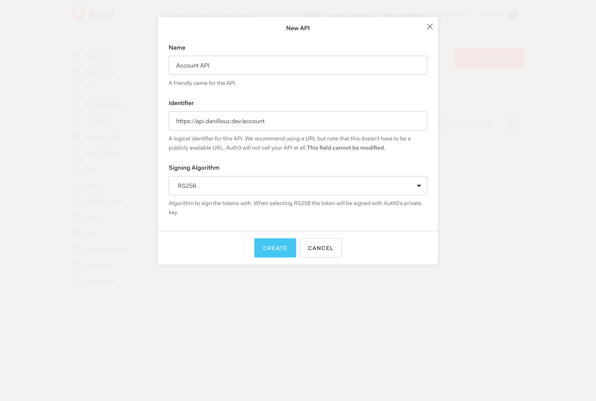
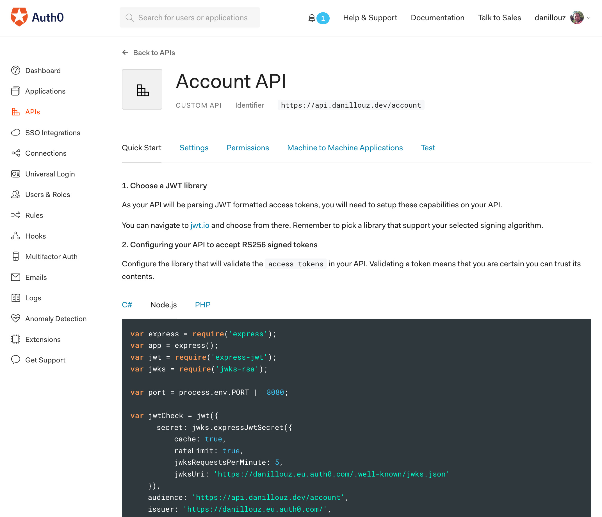
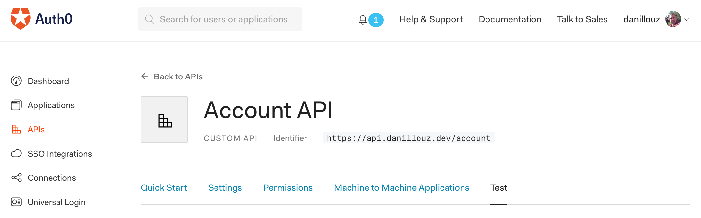
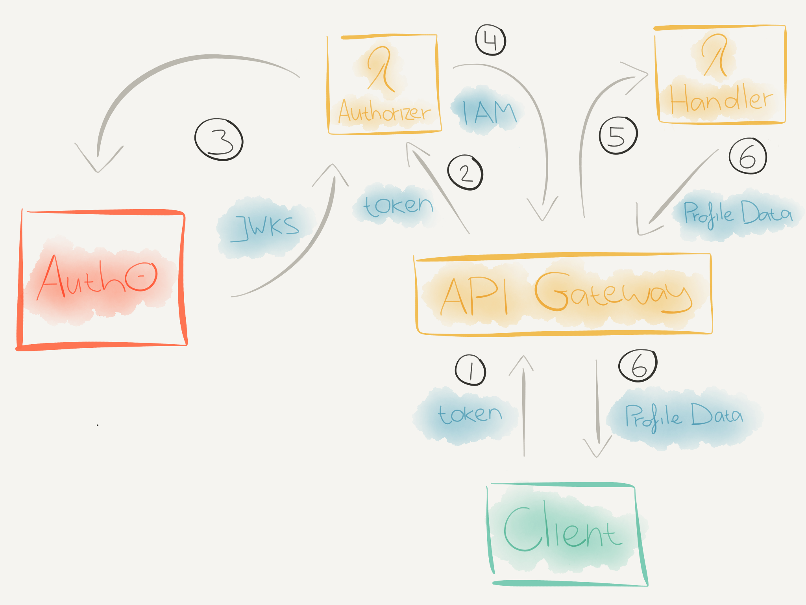
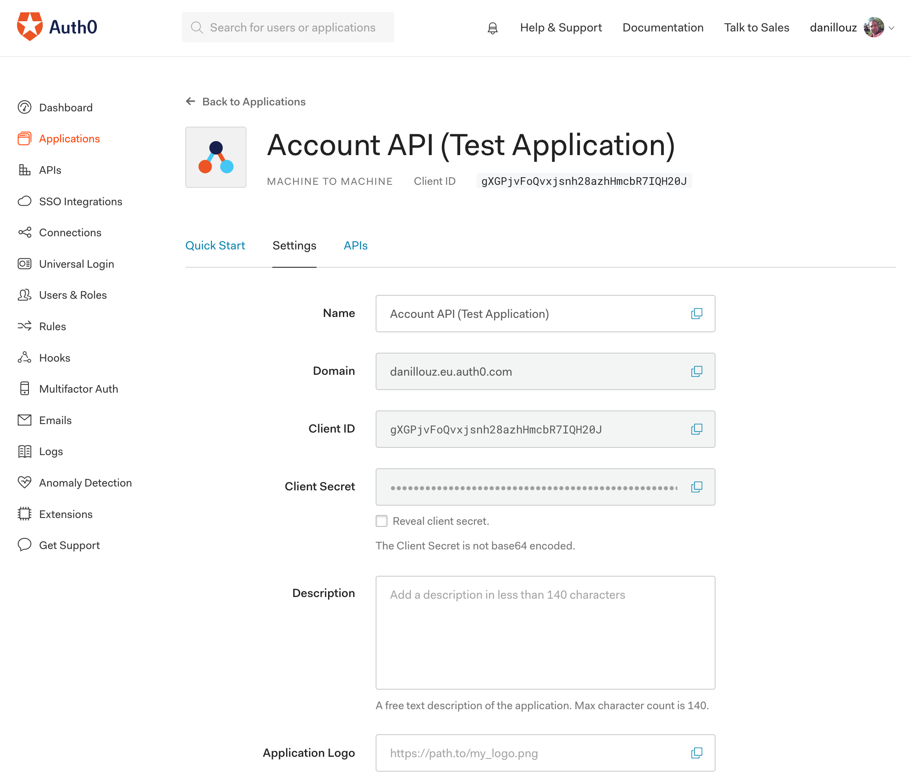
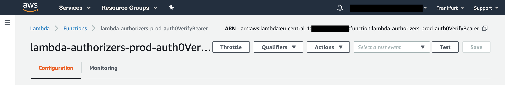
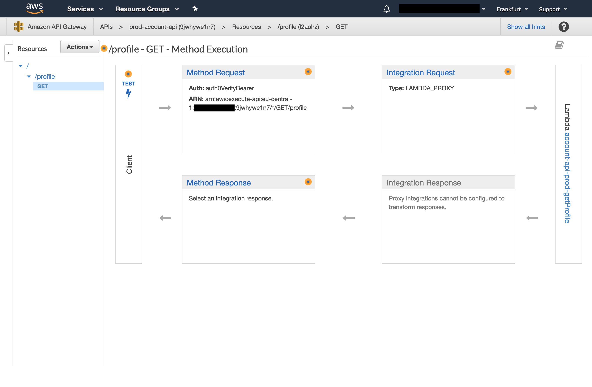

Auth is complicated--it can be difficult to reason about and can be hard to work with. The terminology can be complex as well and terms are sometimes used interchangeably or can be ambiguous. Like saying "auth" to refer to both authentication (who are you?) and authorization (I know who you are, but what are you allowed to do?).

On top of that, it can also be challenging to know when to use what. Depending on what you're building and for whom, different auth protocols and strategies might be more suitable or required.

In this post I won't be exploring these protocols and strategies in depth. Instead, I want to show you that implementing something as complex as auth doesn't have to be difficult. In order to do that, I'll focus on a specific (but common) use case and show you a way to implement it--using a specific set of technologies.

### Table of contents

- [Use case and technologies](#use-case-and-technologies)
- [Why use a third party auth provider?](#why-use-a-third-party-auth-provider)
- [What will we build?](#what-will-we-build)
- [Registering the API with Auth0](#registering-the-api-with-auth0)
- [What’s a Lambda Authorizer?](#whats-a-lambda-authorizer)
- [Solidifying our mental model](#solidifying-our-mental-model)
- [Implementing the Lambda Authorizer](#implementing-the-lambda-authorizer)
- [Implementing the Account API](#implementing-the-account-api)
- [CORS headers](#cors-headers)
- [In closing](#in-closing)

If you just want to read the code, go to <a href="https://github.com/danillouz/serverless-auth" target="_blank" rel="noopener noreferrer">github.com/danillouz/serverless-auth</a>.

## Use case and technologies

> How can we secure an HTTP API with a token based authentication strategy. So only authenticated- and authorized users can access it via a (web) client?

More specifically:

- The HTTP API is an <a href="https://docs.aws.amazon.com/apigateway/latest/developerguide/welcome.html" target="_blank" rel="noopener noreferrer">AWS API Gateway</a> (APIG).
- The API endpoints are protected with a <a href="https://oauth.net/2/bearer-tokens/" target="_blank" rel="noopener noreferrer">bearer token</a> and implemented as <a href="https://docs.aws.amazon.com/apigateway/latest/developerguide/set-up-lambda-proxy-integrations.html" target="_blank" rel="noopener noreferrer">Lambda Proxy Integrations</a> (i.e. Lambda handlers).
- The Lambda handlers are implemented using <a href="https://nodejs.org/en/" target="_blank" rel="noopener noreferrer">Node.js</a> and the <a href="https://serverless.com/" target="_blank" rel="noopener noreferrer">Serverless Framework</a>.
- <a href="https://auth0.com/" target="_blank" rel="noopener noreferrer">Auth0</a> is used as a third party auth provider.
- An <a href="https://docs.aws.amazon.com/apigateway/latest/developerguide/apigateway-use-lambda-authorizer.html" target="_blank" rel="noopener noreferrer">APIG Lambda Authorizer</a> is used to verify the token with Auth0.
- <a href="https://en.wikipedia.org/wiki/CURL" target="_blank" rel="noopener noreferrer">cURL</a> (`curl`) is used as the client to send HTTP requests to the API with a token.

## Why use a third party auth provider?

I mentioned that I'll be using Auth0 as a third party auth provider. This means that I'm choosing _not_ to build (nor operate!) my own "auth server". So before we get started, I think it's important to explain the motivation behind this decision.

In order to build an auth server you could use:

- <a href="https://oauth.net/2/" target="_blank" rel="noopener noreferrer">OAuth 2.0</a>: an authorization protocol.

- <a href="https://openid.net/connect/" target="_blank" rel="noopener noreferrer">OpenID Connect (OIDC)</a>: an authentication protocol. This is an "identity layer" built on top of OAuth 2.0.

- <a href="https://auth0.com/learn/token-based-authentication-made-easy/" target="_blank" rel="noopener noreferrer">Token based authentication</a>: a strategy that requires a client to send a signed bearer token when making requests to a protected API. The API will only respond to requests successfully when it received a verified token.

- <a href="https://tools.ietf.org/html/rfc7519" target="_blank" rel="noopener noreferrer">JSON Web Tokens (JWTs)</a>: a way to send auth information ("claims") as JSON. The JWT contains a "Header", "Payload" and "Signature" which are Base64 encoded and "dot" separated. In effect, the JWT is used as the bearer token. You can see how a JWT looks like by visiting <a href="https://jwt.io/" target="_blank" rel="noopener noreferrer">jwt.io</a>.

And with perhaps the help of some other tools/libraries, you might be confident enough to build it. But I think that (in most cases) you shouldn't go down this route. Why not? Because it will cost you and your team a _lot_ of time, energy and money to build, operate and maintain it.

And even if you do manage to build it, the result can be poor. There will be bugs, and edge cases you didn't think of. But because auth is a nontrivial problem to solve, you might even implement (parts of) the spec incorrectly.

If you do have a valid use case, plus enough resources and knowledge to build your own auth server, tread carefully. **A poor implementation will lead to a bad user experience and is also dangerous, because it can compromise your users and organization.**

What should you do then? In my opinion, use a third party auth provider like <a href="https://aws.amazon.com/cognito/" target="_blank" rel="noopener noreferrer">Cognito</a> or <a href="https://auth0.com/" target="_blank" rel="noopener noreferrer">Auth0</a>. They give you all the fancy tooling, scalable infrastructure and resources you will need to provide a _secure_, _reliable_, _performant_ and _usable_ solution. Sure, you'll have to pay for it, but the pricing is _very_ fair. And it will most likely be a small fraction of what it would cost you when you'd roll your own solution.

Another (sometimes overlooked) benefit of choosing _buy over build_, is that you'll get access to the domain expert's _knowledge_. Where they can advise and help you choose the best auth strategy for your use case. And last but not least--leaving the complexities and challenges of auth to the experts, gives you the ability to _focus_ on your own things again!

However, I do recommend you build an auth service yourself for learning purposes. I think it's quite fun and challenging. And more importantly, you'll get a deeper understanding of the subject--which will be _very_ helpful when you're navigating the "documentation jungle" of your favorite auth provider.

Okay, lets get started!

## What will we build?

We'll build an Account API with a single endpoint that returns some profile data.

Requirements and constraints are:

- The endpoint will be `GET /profile`.
- The business logic of the endpoint will be implemented by a Lambda handler:
  - The Lambda will return data as JSON.
  - The Lambda will return a single property `name` with value `Daniël`.
  - The Lambda will return HTTP status code `200`.
- The endpoint will require a bearer token to return the profile data.
  - The token will be sent via the `Authorization` request header.
  - The `Authorization` request header value must have the format: `Bearer TOKEN`.
  - The token is verified by a Lambda Authorizer with the help of Auth0.

### Example

Request:

```
HTTP GET /profile
Authorization: Bearer eyJ...lKw
```

Response:

```
HTTP 200 OK
Content-Type: application/json
```

```json
{
  "name": "Daniël"
}
```

## Registering the API with Auth0

When the Account API receives a request with the bearer token, it will have to verify the token with Auth0. In order to do that, we first have to register our API with them:

1. Create an Auth0 account and setup your tenant.
2. In the Auth0 dashboard, navigate to "APIs" and click on "Create API".
3. Follow the <a href="https://auth0.com/docs/apis" target="_blank" rel="noopener noreferrer">instructions</a> and provide a "Name" and "Identifier". For example `Account API` and `https://api.danillouz.dev/account`.
4. Use `RS256` as the signing algorithm (more on that later).
5. Click on "Create".

<figure>
  
  <figcaption>Register you API with Auth0 by providing a name and identifier.</figcaption>
</figure>

### Lambda Authorizer configuration

Now that our API is registered with Auth0, we need to take note of the following (public) properties, to later on configure our Lambda Authorizer:

- Token issuer: this is basically your Auth0 tenant. It always has the format `https://TENANT_NAME.REGION.auth0.com`. For example `https://danillouz.eu.auth0.com/`.
- JWKS URI: this returns a <a href="https://auth0.com/docs/jwks" target="_blank" rel="noopener noreferrer">JSON Web Key Set (JWKS)</a>. The URI will be used by the Lambda Authorizer to fetch a public key from Auth0 and verify the token (more on that later). It always has the format `https://TENANT_NAME.REGION.auth0.com/.well-known/jwks.json`. For example `https://danillouz.eu.auth0.com/.well-known/jwks.json`.
- Audience: this is the "Identifier" you provided during registration (step 3). For example `https://api.danillouz.dev/account`. Note that this doesn't have to be a "real" endpoint.

You can also find these values in the "Quick Start" section of the Auth0 API details screen (you were redirected there after registering the API). For example, click on the "Node.js" tab and look for these properties:

- `issuer`
- `jwksUri`
- `audience`

<figure>
  
  <figcaption>Find your public auth properties.</figcaption>
</figure>

### Getting a test token

We can get a test token by navigating to the "Test" tab in the Auth0 API details screen:

<figure>
  
  <figcaption>Get a generated test token for you API.</figcaption>
</figure>

And if you scroll to the bottom, you'll see a `curl` command displayed with a ready to use test token:

```
curl --request GET \
  --url http://path_to_your_api/ \
  --header 'authorization: Bearer eyJ...lKw
```

Pretty cool right! We'll use this command after we implement the Lambda Authorizer and the Account API.

## What's a Lambda Authorizer?

I haven't explained what a Lambda Authorizer is yet. In short, it's a feature of APIG to control access to an API. The AWS <a href="https://docs.aws.amazon.com/apigateway/latest/developerguide/apigateway-use-lambda-authorizer.html" target="_blank" rel="noopener noreferrer">docs</a> say:

> A Lambda authorizer is useful if you want to implement a custom authorization scheme that uses a bearer token authentication strategy such as OAuth...

There are actually two types of Lambda Authorizers:

1. Token based-authorizers.
2. Request parameter-based authorizers.

And we'll be using the token-based one, because it supports bearer tokens.

### What should it do?

When a client makes a request to APIG, AWS will invoke the Lambda Authorizer _first_ (if one is configured). The Lambda Authorizer must then extract the bearer token from the `Authorization` request header and validate it by:

1. Fetching the JWKS (which contains the public key) from Auth0 using the JWKS URI.
2. Verifying the token signature with the fetched public key.
3. Verifying the token has the correct issuer and audience claims.

> We get the JWKS URI, issuer and audience values after [registering the API with Auth0](#lambda-authorizer-configuration).

Only when the token passes these checks, should the Lambda Authorizer output an <a href="https://docs.aws.amazon.com/IAM/latest/UserGuide/access_policies.html" target="_blank" rel="noopener noreferrer">IAM Policy</a> document with `Effect` set to `Allow`:

```js
{
  "Version": "2012-10-17",
  "Statement": [
    {
      "Action": "execute-api:Invoke",
      "Effect": "Allow", // highlight-line
      "Resource": "ARN_OF_LAMBDA_HANDLER"
    }
  ]
}
```

It's this policy that tells APIG it's _allowed_ to invoke our downstream Lambda handler--in our case, that will be the Lambda handler that returns the profile data.

Alternatively, the Lambda authorizer may _deny_ invoking the downstream handler by setting `Effect` to `Deny`:

```js
{
  "Version": "2012-10-17",
  "Statement": [
    {
      "Action": "execute-api:Invoke",
      "Effect": "Deny", // highlight-line
      "Resource": "ARN_OF_LAMBDA_HANDLER"
    }
  ]
}
```

This will make APIG respond with `403 Forbidden`. Or you may return an `Unauthorized` error from the Lambda Authorizer to have APIG respond with `401 Unauthorized`.

### A note on authorization

I found it good practice to only _authenticate_ the caller from the Lambda Authorizer and apply _authorization_ logic _downstream_.

This may not be feasible in all use cases, but doing this keeps your Lambda Authorizer _simple_. Because it will only be responsible for:

- Verifying the token.
- Propagating authorization information downstream.

The downstream Lambda handler will then use the authorization information to decide if it should execute its "business logic" for the specific caller. And following this design also leads to a nice "decoupling" between the authentication- and authorization logic, i.e. between the Lambda Authorizer and Lambda handlers.

You can propagate authorization information by returning a `context` object in the Lambda Authorizer's response:

```js
'use strict';

module.exports.authorizer = event => {
  const authResponse = {
    principalId: 'UNIQUE_USER_ID',
    policyDocument: {
      Version: '2012-10-17',
      Statement: [
        {
          Action: 'execute-api:Invoke',
          Effect: 'Allow',
          Resource: event.methodArn
        }
      ]
    },
    context: {
      scope: 'get:profile' // highlight-line
    }
  };

  return authResponse;
};
```

But there's a caveat here. You can _not_ set a JSON object or array as a valid value of any key in the `context` object. It must be either a `String`, `Number` or `Boolean`:

```js
context: {
  a: 'value', // OK
  b: 1, // OK
  c: true, // OK
  d: [9, 8, 7], // Will NOT be serialized
  e: { x: 'value', y: 99, z: false } // Will NOT be serialized
}
```

Any "valid" properties passed to the `context` object are made available to downstream Lambda handlers via the `event` object:

```js
'use strict';

module.exports.handler = event => {
  const { authorizer } = event.requestContext;
  console.log('scope: ', authorizer.scope); // "get:profile"
};
```

When using OAuth 2.0, "scope" can be provided and used to apply authorization logic. In our case we could have a `get:profile` scope. And the Lambda handler could check if the caller has this scope in `authorizer.scope` when executing. If it's not there, it can return a `403 Forbidden`.

I won't show how to configure scope with Auth0, but the <a href="https://auth0.com/docs/scopes/current" target="_blank" rel="noopener noreferrer">docs</a> should point you in the right direction.

## Solidifying our mental model

With that covered, we're ready to build the Lambda Authorizer and the Account API. But before we do, let's take a step back and solidify our mental model first.

To summarize, we need the following components to protect our API:

- Auth0 as the third party auth provider to issue- and help verify bearer tokens.
- AWS APIG to represent the API.
- A Lambda Authorizer to verify tokens with Auth0.
- A Lambda handler for the `GET /profile` endpoint to return the profile data.
- `curl` as the client to send HTTP requests to the API with a token.

We can visualize how these components will interact with each other like this:

<figure>
  
  <figcaption>The auth flow visualized.</figcaption>
</figure>

<ol>
  <li><code class="language-text">curl</code> will send an HTTP request to the <code class="language-text">GET /profile</code> endpoint with a token via the <code class="language-text">Authorization</code> request header.</li>

  <li>When the HTTP request reaches APIG, it will check if a Lambda Authorizer is configured for the called endpoint. If so, APIG will invoke the Lambda Authorizer.</li>

  <li>The Lambda Authorizer will then:
    <ul>
      <li>Extract the token from the <code class="language-text">Authorization</code> request header.</li>
      <li>Fetch the JWKS (which contains the public key) from Auth0.</li>
      <li>Verify the token signature with the fetched public key.</li>
      <li>Verify the token has the correct issuer and audience claims.</li>
    </ul>
  </li>

  <li>If the token is verified, the Lambda Authorizer will return an IAM Policy document with <code class="language-text">Effect</code> set to <code class="language-text">Allow</code>.</li>

  <li>APIG will now evaluate the IAM Policy and if the <code class="language-text">Effect</code> is set to <code class="language-text">Allow</code>, it will invoke the Lambda handler.
  </li>

  <li>The Lambda handler will execute and return the profile data back to the client.</li>
</ol>

Great, now the easy part, writing the code!

## Implementing the Lambda Authorizer

Create a new directory for the code:

```shell
mkdir lambda-authorizers
```

Move to this directory and initialize a new <a href="https://www.npmjs.com/" target="_blank" rel="noopener noreferrer">npm</a> project with:

```shell
npm init -y
```

This creates a `package.json` file:

```shell
lambda-authorizers
  └── package.json # highlight-line
```

Now install the following required npm dependencies:

```shell
npm i jsonwebtoken jwks-rsa
```

The <a href="https://github.com/auth0/node-jsonwebtoken" target="_blank" rel="noopener noreferrer">jsonwebtoken</a> library will help use decode the bearer token (JWT) and verify its signature, issuer and audience claims. The <a href="https://github.com/auth0/node-jwks-rsa" target="_blank" rel="noopener noreferrer">jwks-rsa</a> library will help us fetch the JWKS from Auth0.

We'll use the Serverless Framework to configure and upload the Lambda to AWS, so install it as a "dev" dependency:

```shell
npm i -D serverless
```

Create a `serverless.yaml` manifest:

```shell
lambda-authorizers
  ├── node_modules
  ├── package-lock.json
  ├── package.json
  └── serverless.yaml # highlight-line
```

Add the following content:

```yaml
service: lambda-authorizers

provider:
  name: aws
  runtime: nodejs8.10
  stage: ${opt:stage, 'prod'}
  region: ${opt:region, 'eu-central-1'}
  memorySize: 128
  timeout: 3

package:
  exclude:
    - ./*
    - ./**/*.test.js
  include:
    - node_modules
    - src
```

Add the properties we got after [registering the API with Auth0](#lambda-authorizer-configuration) as environment variables. For example:

```yaml
service: lambda-authorizers

provider:
  name: aws
  runtime: nodejs8.10
  stage: ${opt:stage, 'prod'}
  region: ${opt:region, 'eu-central-1'}
  memorySize: 128
  timeout: 3
  # highlight-start
  environment:
    JWKS_URI: 'https://danillouz.eu.auth0.com/.well-known/jwks.json'
    TOKEN_ISSUER: 'https://danillouz.eu.auth0.com/'
    AUDIENCE: 'https://api.danillouz.dev/account'
  # highlight-end

package:
  exclude:
    - ./*
    - ./**/*.test.js
  include:
    - node_modules
    - src
```

And add the Lambda function definition:

```yaml
service: lambda-authorizers

provider:
  name: aws
  runtime: nodejs8.10
  stage: ${opt:stage, 'prod'}
  region: ${opt:region, 'eu-central-1'}
  memorySize: 128
  timeout: 3
  environment:
    JWKS_URI: 'https://danillouz.eu.auth0.com/.well-known/jwks.json'
    TOKEN_ISSUER: 'https://danillouz.eu.auth0.com/'
    AUDIENCE: 'https://api.danillouz.dev/account'

package:
  exclude:
    - ./*
    - ./**/*.test.js
  include:
    - node_modules
    - src

# highlight-start
functions:
  auth0VerifyBearer:
    handler: src/auth0.verifyBearer
    description: Verifies the bearer token with the help of Auth0
# highlight-end
```

That's it for the Serverless manifest. You can find more information about it in the <a href="https://serverless.com/framework/docs/providers/aws/guide/serverless.yml/" target="_blank" rel="noopener noreferrer">docs</a>.

In order to match the Lambda function definition, create a file named `auth0.js` in `src`:

```shell
lambda-authorizers
  ├── node_modules
  ├── package-lock.json
  ├── package.json
  ├── serverless.yaml
  └── src
      └── auth0.js # highlight-line
```

And in `src/auth0.js` export a function named `verifyBearer`:

```js
'use strict';

module.exports.verifyBearer = async event => {
  try {
    // Lambda Authorizer implementation goes here
  } catch (err) {
    console.log('Authorizer Error: ', err);

    throw new Error('Unauthorized');
  }
};
```

If something goes "wrong" in the Lambda, we'll log the error and throw a new `Unauthorized` error. This will make APIG return a `401 Unauthorized` response back to the caller. Note that the thrown error _must_ match the string `'Unauthorized'` _exactly_ for this to work.

The Lambda will first have to get the bearer token from the `Authorization` request header. Create a helper function for that in `src/get-token.js`:

```shell
lambda-authorizers
  ├── node_modules
  ├── package-lock.json
  ├── package.json
  ├── serverless.yaml
  └── src
      ├── auth0.js
      └── get-token.js # highlight-line
```

And in this file export a function named `getToken`:

```js
'use strict';

module.exports = function getToken(event) {
  if (event.type !== 'TOKEN') {
    throw new Error('Authorizer must be of type "TOKEN"');
  }

  const { authorizationToken: bearer } = event;
  if (!bearer) {
    throw new Error(
      'Authorization header with "Bearer TOKEN" must be provided'
    );
  }

  const [, token] = bearer.match(/^Bearer (.*)$/) || [];
  if (!token) {
    throw new Error('Invalid bearer token');
  }

  return token;
};
```

Here we're only interested in `TOKEN` events because we're implementing a [token-based authorizer](#whats-a-lambda-authorizer). And we can access the value of the `Authorization` request header via the `event.authorizationToken` property.

Then `require` and call the helper in the Lambda with the APIG HTTP input <a href="https://docs.aws.amazon.com/apigateway/latest/developerguide/set-up-lambda-proxy-integrations.html#api-gateway-simple-proxy-for-lambda-input-format" target="_blank" rel="noopener noreferrer">event</a> as an argument:

```js
'use strict';

const getToken = require('./get-token'); // highlight-line

module.exports.verifyBearer = async event => {
  try {
    const token = getToken(event); // highlight-line
  } catch (err) {
    console.log('Authorizer Error: ', err);

    throw new Error('Unauthorized');
  }
};
```

Now we have the token, we need to verify it. We'll use another helper function for that in `src/verify-token.js`:

```shell
lambda-authorizers
  ├── node_modules
  ├── package-lock.json
  ├── package.json
  ├── serverless.yaml
  └── src
      ├── auth0.js
      ├── get-token.js
      └── verify-token.js # highlight-line
```

This helper will do 3 things:

1. Decode the bearer token (JWT).
2. Fetch the public key from Auth0 using the JWKS URI (used to verify the token signature).
3. Verify the token signature, issuer and audience claims.

Export a function named `verifyToken` in `src/verify-token.js`:

```js
'use strict';

module.exports = async function verifyToken(
  token,
  decodeJwt,
  getSigningKey,
  verifyJwt,
  issuer,
  audience
) {
  // Step 1
  const decoded = decodeJwt(token, { complete: true });

  if (!decoded || !decoded.header || !decoded.header.kid) {
    throw new Error('Invalid JWT');
  }

  // Step 2
  const { publicKey, rsaPublicKey } = await getSigningKey(decoded.header.kid);
  const signingKey = publicKey || rsaPublicKey;

  // Step 3
  return verifyJwt(token, signingKey, {
    issuer,
    audience
  });
};
```

After we decode the token with the option `{ complete: true }`, we can access the JWT `header` data. And using the <a href="https://community.auth0.com/t/what-is-the-origin-of-the-kid-claim-in-the-jwt/8431" target="_blank" rel="noopener noreferrer">kid</a> JWT claim, we can find out which key from the returned JWKS was used to sign the token.

When we registered the API with Auth0 we chose the `RS256` signing algorithm. This algorithm generates an asymmetric signature. Which basically means that Auth0 uses a _private key_ to sign a JWT when it issues one. And we can use a _public key_ (which we can fetch with the JWKS URI) to verify the authenticity of the token.

First require the helper in the Lambda and pass the `token` as the first argument when calling it:

```js
'use strict';

const getToken = require('./get-token');
const verifyToken = require('./verify-token'); // highlight-line

module.exports.verifyBearer = async event => {
  try {
    const token = getToken(event);
    const verifiedData = await verifyToken(
      token // highlight-line
    );
  } catch (err) {
    console.log('Authorizer Error: ', err);

    throw new Error('Unauthorized');
  }
};
```

To decode the token in the helper (step 1), we'll use the `jsonwebtoken` library. It exposes a `decode` method. Pass this method as the second argument when calling the helper:

```js
'use strict';

const jwt = require('jsonwebtoken'); // highlight-line

const getToken = require('./get-token');
const verifyToken = require('./verify-token');

module.exports.verifyBearer = async event => {
  try {
    const token = getToken(event);
    const verifiedData = await verifyToken(
      token,
      jwt.decode // highlight-line
    );
  } catch (err) {
    console.log('Authorizer Error: ', err);

    throw new Error('Unauthorized');
  }
};
```

To fetch the public key from Auth0 (step 2) we'll use the `jwks-rsa` library. It exposes a client with `getSigningKey` method to fetch the key. Pas a "promisified" version of this method as the third argument when calling the helper:

```js
'use strict';

const util = require('util'); // highlight-line

const jwt = require('jsonwebtoken');
const jwksRSA = require('jwks-rsa'); // highlight-line

const getToken = require('./get-token');
const verifyToken = require('./verify-token');

const { JWKS_URI } = process.env; // highlight-line

// highlight-start
const jwksClient = jwksRSA({
  cache: true,
  rateLimit: true,
  jwksUri: JWKS_URI
});
const getSigningKey = util.promisify(jwksClient.getSigningKey);
// highlight-end

module.exports.verifyBearer = async event => {
  try {
    const token = getToken(event);
    const verifiedData = await verifyToken(
      token,
      jwt.decode,
      getSigningKey // highlight-line
    );
  } catch (err) {
    console.log('Authorizer Error: ', err);

    throw new Error('Unauthorized');
  }
};
```

Finally, to verify the token signature, issuer and audience claims (step 3) we'll use the `jsonwebtoken` library again. It exposes a `verify` method. Pass a "promisified" version of this method together with the `TOKEN_ISSUER` and `AUDIENCE` as the final arguments when calling the helper:

```js
'use strict';

const util = require('util');

const jwt = require('jsonwebtoken');
const jwksRSA = require('jwks-rsa');

const getToken = require('./get-token');
const verifyToken = require('./verify-token');

const {
  JWKS_URI,
  TOKEN_ISSUER, // highlight-line
  AUDIENCE // highlight-line
} = process.env;

const jwksClient = jwksRSA({
  cache: true,
  rateLimit: true,
  jwksUri: JWKS_URI
});
const getSigningKey = util.promisify(jwksClient.getSigningKey);

const verifyJwt = util.promisify(jwt.verify); // highlight-line

module.exports.verifyBearer = async event => {
  try {
    const token = getToken(event);
    const verifiedData = await verifyToken(
      token,
      jwt.decode,
      getSigningKey,
      verifyJwt, // highlight-line
      TOKEN_ISSUER, // highlight-line
      AUDIENCE // highlight-line
    );
  } catch (err) {
    console.log('Authorizer Error: ', err);

    throw new Error('Unauthorized');
  }
};
```

When the helper verifies the token, it will return the JWT Payload data as `verifiedData`. For example:

```json
{
  "iss": "https://danillouz.eu.auth0.com/",
  "sub": "gXGPjvFoQvxjsnh28azhHmcbR7IQH20J@clients",
  "aud": "https://api.danillouz.dev/account",
  "iat": 1560521845,
  "exp": 1560608245,
  "azp": "gXGPjvFoQvxjsnh28azhHmcbR7IQH20J",
  "gty": "client-credentials"
}
```

We'll use this to create the `authResponse`:

```js
'use strict';

const util = require('util');

const jwt = require('jsonwebtoken');
const jwksRSA = require('jwks-rsa');

const getToken = require('./get-token');
const verifyToken = require('./verify-token');

const { JWKS_URI, TOKEN_ISSUER, AUDIENCE } = process.env;

const jwksClient = jwksRSA({
  cache: true,
  rateLimit: true,
  jwksUri: JWKS_URI
});
const getSigningKey = util.promisify(jwksClient.getSigningKey);

const verifyJwt = util.promisify(jwt.verify);

module.exports.verifyBearer = async event => {
  try {
    const token = getToken(event);
    const verifiedData = await verifyToken(
      token,
      jwt.decode,
      getSigningKey,
      verifyJwt,
      TOKEN_ISSUER,
      AUDIENCE
    );

    // highlight-start
    const userId = verifiedData.sub;
    const authResponse = {
      principalId: userId,
      policyDocument: {
        Version: '2012-10-17',
        Statement: [
          {
            Action: 'execute-api:Invoke',
            Effect: 'Allow',
            Resource: event.methodArn
          }
        ]
      }
    };

    return authResponse;
    // highlight-end
  } catch (err) {
    console.log('Authorizer Error: ', err);

    throw new Error('Unauthorized');
  }
};
```

The `authResponse.principalId` property must represent a unique (user) identifier associated with the token sent by the client. Auth0 provides this via the JWT `sub` claim and ours has the value:

```json
{
  "iss": "https://danillouz.eu.auth0.com/",
  "sub": "gXGPjvFoQvxjsnh28azhHmcbR7IQH20J@clients", // highlight-line
  "aud": "https://api.danillouz.dev/account",
  "iat": 1560521845,
  "exp": 1560608245,
  "azp": "gXGPjvFoQvxjsnh28azhHmcbR7IQH20J",
  "gty": "client-credentials" // highlight-line
}
```

Note that if you use the Auth0 test token, the `sub` claim will be postfixed with `@clients`. This is because Auth0 automatically created a "Test Application" for us when we registered the Account API with them. And it's via this test application that we obtain the test token--using the <a href="https://auth0.com/docs/flows/concepts/client-credentials">client credentials grant</a> to be specific, as denoted by the `gty` (grant type) claim.

In this case the test application represents a "machine" and _not_ a user. But that's fine because the machine has a unique identifier the same way a user would have (by means of a client ID). This means this implementation will also work when using "user centric" auth flows like the <a href="https://auth0.com/docs/flows/concepts/implicit">implicit grant</a>.

You can find the test application in the Auth0 dashboard by navigating to "Applications" and selecting "Account API (Test Application)":

<figure>
  
  <figcaption>The client ID is <code class="language-text">gXGPjvFoQvxjsnh28azhHmcbR7IQH20J</code> which matches the JWT <code class="language-text">sub</code> claim.</figcaption>
</figure>

The ARN of the Lambda handler associated with the called endpoint can be obtained from `event.methodArn`. APIG will use this ARN to invoke said Lambda handler--in our case this will be the Lambda handler that gets the profile data.

As mentioned when [discussing authorization](#a-note-on-authorization), Auth0 can also provide scope a custom JWT claim. But we didn't configure this and that's why it's not part of the `verifiedData`. If it is configured, you can propagate it downstream like this:

```js
const authResponse = {
  principalId: userId,
  policyDocument: {
    Version: '2012-10-17',
    Statement: [
      {
        Action: 'execute-api:Invoke',
        Effect: 'Allow',
        Resource: event.methodArn
      }
    ]
  },
  // highlight-start
  context: {
    scope: verifiedData.scope
  }
  // highlight-end
};
```

Finally, add a release command to the `package.json`:

```json
{
  "name": "lambda-authorizers",
  "version": "1.0.0",
  "description": "APIG Lambda Authorizers.",
  "scripts": {
    "test": "echo \"Error: no test specified\" && exit 1",
    "release": "serverless deploy --stage prod" // highlight-line
  },
  "author": "Daniël Illouz",
  "license": "MIT",
  "dependencies": {
    "jsonwebtoken": "^8.5.1",
    "jwks-rsa": "^1.5.1"
  },
  "devDependencies": {
    "serverless": "^1.45.1"
  }
}
```

In order to upload the Lambda to AWS, make sure you have your <a href="https://docs.aws.amazon.com/cli/latest/userguide/cli-configure-files.html" target="_blank" rel="noopener noreferrer">AWS credentials configured</a>. Then release the Lambda with:

```shell
npm run release
```

And enjoy watching Serverless do all the heavy lifting for us:

```
Serverless: Packaging service...
Serverless: Excluding development dependencies...
Serverless: Creating Stack...
Serverless: Checking Stack create progress...
.....
Serverless: Stack create finished...
Serverless: Uploading CloudFormation file to S3...
Serverless: Uploading artifacts...
Serverless: Uploading service lambda-authorizers.zip file to S3 (6.16 MB)...
Serverless: Validating template...
Serverless: Updating Stack...
Serverless: Checking Stack update progress...
...............
Serverless: Stack update finished...
Service Information
service: lambda-authorizers
stage: prod
region: eu-central-1
stack: lambda-authorizers-prod
resources: 5
api keys:
  None
endpoints:
  None
functions:
  auth0VerifyBearer: lambda-authorizers-prod-auth0VerifyBearer
layers:
  None
```

Now go to the AWS Console and visit the "Lambda" service. There find `lambda-authorizers-prod-auth0VerifyBearer` under "Functions" and take note of the ARN in the top right corner:

<figure>
  
  <figcaption>Finding the ARN of the Lambda Authorizer</figcaption>
</figure>

We'll need this to configure the Account API in the next part.

## Implementing the Account API

Similar to the Lambda Authorizer, create a new directory for the code:

```shell
mkdir account-api
```

Move to this directory and initialize a new <a href="https://www.npmjs.com/" target="_blank" rel="noopener noreferrer">npm</a> project with:

```shell
npm init -y
```

This creates a `package.json` file:

```shell
account-api
  └── package.json # highlight-line
```

Again, we'll use the Serverless Framework to configure and upload the Lambda to AWS, so install it as a "dev" dependency:

```shell
npm i -D serverless
```

Create a `serverless.yaml` manifest:

```shell
account-api
  ├── node_modules
  ├── package-lock.json
  ├── package.json
  └── serverless.yaml # highlight-line
```

With the following content:

```yaml
service: account-api

provider:
  name: aws
  runtime: nodejs8.10
  stage: ${opt:stage, 'prod'}
  region: ${opt:region, 'eu-central-1'}
  memorySize: 128
  timeout: 3

package:
  exclude:
    - ./*
    - ./**/*.test.js
  include:
    - node_modules
    - src
```

Add the Lambda function definition for the `GET /profile` endpoint handler:

```yaml
service: account-api

provider:
  name: aws
  runtime: nodejs8.10
  stage: ${opt:stage, 'prod'}
  region: ${opt:region, 'eu-central-1'}
  memorySize: 128
  timeout: 3

package:
  exclude:
    - ./*
    - ./**/*.test.js
  include:
    - node_modules
    - src

# highlight-start
functions:
  getProfile:
    handler: src/handler.getProfile
    description: Gets the user profile data
    events:
      - http:
          path: /profile
          method: get
# highlight-end
```

In order to match the Lambda function definition, create a file named `handler.js` in `src`:

```shell
account-api
  ├── node_modules
  ├── package-lock.json
  ├── package.json
  ├── serverless.yaml
  └── src
      └── handler.js # highlight-line
```

And in `src/handler.js` export a function named `getProfile`:

```js
'use strict';

module.exports.getProfile = async () => {
  const profileData = {
    name: 'Daniël'
  };

  return {
    statusCode: 200,
    body: JSON.stringify(profileData)
  };
};
```

The Lambda handler returns an <a href="https://docs.aws.amazon.com/apigateway/latest/developerguide/set-up-lambda-proxy-integrations.html#api-gateway-simple-proxy-for-lambda-output-format" target="_blank" rel="noopener noreferrer">HTTP output</a> object with the profile data as JSON.

And this is actually all we need. Before we protect the endpoint, lets release it to see if we can call it.

Add a release command to the `package.json`:

```json
{
  "name": "account-api",
  "version": "1.0.0",
  "description": "Account API that returns a user profile.",
  "scripts": {
    "test": "echo \"Error: no test specified\" && exit 1",
    "release": "serverless deploy --stage prod" // highlight-line
  },
  "author": "Daniël Illouz",
  "license": "MIT",
  "devDependencies": {
    "serverless": "^1.45.1"
  }
}
```

Then release the Lambda with:

```shell
npm run release
```

Sit back and relax:

```shell
Serverless: Packaging service...
Serverless: Excluding development dependencies...
Serverless: Creating Stack...
Serverless: Checking Stack create progress...
.....
Serverless: Stack create finished...
Serverless: Uploading CloudFormation file to S3...
Serverless: Uploading artifacts...
Serverless: Uploading service account-api.zip file to S3 (374 B)...
Serverless: Validating template...
Serverless: Updating Stack...
Serverless: Checking Stack update progress...
..............................
Serverless: Stack update finished...
Service Information
service: account-api
stage: prod
region: eu-central-1
stack: account-api-prod
resources: 10
api keys:
  None
endpoints:
  GET - https://9jwhywe1n7.execute-api.eu-central-1.amazonaws.com/prod/profile # highlight-line
functions:
  getProfile: account-api-prod-getProfile
layers:
  None
```

Now try to call the endpoint that has been created for you. For example:

```shell
curl https://9jwhywe1n7.execute-api.eu-central-1.amazonaws.com/prod/profile
```

It should return:

```json
{ "name": "Daniël" }
```

Now we know the endpoint is working, we'll protect it by adding a custom `authorizer` property in the `serverless.yaml` manifest:

```yaml
service: account-api

# highlight-start
custom:
  authorizer:
    arn: arn: aws:lambda:eu-central-1:ACCOUNT_ID:function:lambda-authorizers-prod-auth0VerifyBearer
    resultTtlInSeconds: 0
    identitySource: method.request.header.Authorization
    identityValidationExpression: '^Bearer [-0-9a-zA-z\.]*$'
    type: token
# highlight-end

provider:
  name: aws
  runtime: nodejs8.10
  stage: ${opt:stage, 'prod'}
  region: ${opt:region, 'eu-central-1'}
  memorySize: 128
  timeout: 3
  profile: danillouz

package:
  exclude:
    - ./*
    - ./**/*.test.js
  include:
    - node_modules
    - src

functions:
  getProfile:
    handler: src/handler.getProfile
    description: Gets the user profile
    events:
      - http:
          path: /profile
          method: get
```

Lets go over the `authorizer` properties:

- `arn`: must be the value of the Lambda Authorizer ARN we released and found in the AWS Lambda console.
- `resultTtlInSeconds`: used to cache the IAM policy document returned from the Lambda Authorizer. When enabled (caching is disabled when set to `0`) and a policy document has been cached, the Lambda Authorizer wont be executed. According to the <a href="https://docs.aws.amazon.com/apigateway/latest/developerguide/configure-api-gateway-lambda-authorization-with-console.html" target="_blank" rel="noopener noreferrer">AWS docs</a> the default value is `300` seconds and the max value is `3600` seconds.
- `identitySource`: where APIG should "look" for the bearer token.
- `identityValidationExpression`: the expression used to extract the bearer token from the `identitySource`.

Now we only have to configure our endpoint to use the Lambda Authorizer:

```yaml
service: account-api

custom:
  authorizer:
    arn: arn: aws:lambda:eu-central-1:ACCOUNT_ID:function:lambda-authorizers-prod-auth0VerifyBearer
    resultTtlInSeconds: 0
    identitySource: method.request.header.Authorization
    identityValidationExpression: '^Bearer [-0-9a-zA-z\.]*$'
    type: token

provider:
  name: aws
  runtime: nodejs8.10
  stage: ${opt:stage, 'prod'}
  region: ${opt:region, 'eu-central-1'}
  memorySize: 128
  timeout: 3
  profile: danillouz

package:
  exclude:
    - ./*
    - ./**/*.test.js
  include:
    - node_modules
    - src

functions:
  getProfile:
    handler: src/handler.getProfile
    description: Gets the user profile
    events:
      - http:
          path: /profile
          method: get
          authorizer: ${self:custom.authorizer} # highlight-line
```

And do another release:

```
npm run release
```

After Serverless finishes, go to the AWS Console and visit the "API Gateway" service. There navigate to "prod-account-api" and then click on the "GET" resource under "/profile". You should now see that the "Method Request" tile has a property "Auth" set to `auth0VerifyBearer`:

<figure>
  
  <figcaption>The resource is configured with a custom authorization scheme.</figcaption>
</figure>

This means our `GET /profile` endpoint is properly configured with a Lambda Authorizer. And we now require a bearer token to get the profile data. Lets verify this by making the same `curl` request like before (without a token):

```shell
curl https://9jwhywe1n7.execute-api.eu-central-1.amazonaws.com/prod/profile
```

It returns:

```json
{ "message": "Unauthorized" }
```

Great, now try the `curl` command from the Auth0 API details "Test" tab (with a token), but set the URL to your profile endpoint. For example:

```
curl --request GET \
  --url https://9jwhywe1n7.execute-api.eu-central-1.amazonaws.com/prod/profile \
  --header 'authorization: Bearer eyJ0q..Y3HZ'
```

This returns the profile data again:

```json
{ "name": "Daniël" }
```

Nice, we successfully secured our API with a token based auth strategy!

## CORS headers

On a final note, when your API needs to return <a href="https://serverless.com/blog/cors-api-gateway-survival-guide" target="_blank" rel="noopener noreferrer">CORS headers</a>, make sure to add a <a href="https://docs.aws.amazon.com/apigateway/latest/developerguide/supported-gateway-response-types.html" target="_blank" rel="noopener noreferrer">custom API Gateway Response</a> as well:

```yaml
service: account-api

custom:
  authorizer:
    arn: arn: aws:lambda:eu-central-1:ACCOUNT_ID:function:lambda-authorizers-prod-auth0VerifyBearer
    resultTtlInSeconds: 0
    identitySource: method.request.header.Authorization
    identityValidationExpression: '^Bearer [-0-9a-zA-z\.]*$'
    type: token

provider:
  name: aws
  runtime: nodejs8.10
  stage: ${opt:stage, 'prod'}
  region: ${opt:region, 'eu-central-1'}
  memorySize: 128
  timeout: 3
  profile: danillouz

package:
  exclude:
    - ./*
    - ./**/*.test.js
  include:
    - node_modules
    - src

functions:
  getProfile:
    handler: src/handler.getProfile
    description: Gets the user profile
    events:
      - http:
          path: /profile
          method: get
          authorizer: ${self:custom.authorizer}

# highlight-start
resources:
  Resources:
    GatewayResponseDefault4XX:
      Type: 'AWS::ApiGateway::GatewayResponse'
      Properties:
        ResponseParameters:
          gatewayresponse.header.Access-Control-Allow-Origin: "'*'"
          gatewayresponse.header.Access-Control-Allow-Headers: "'*'"
        ResponseType: DEFAULT_4XX
        RestApiId:
          Ref: 'ApiGatewayRestApi'
    GatewayResponseDefault5XX:
      Type: 'AWS::ApiGateway::GatewayResponse'
      Properties:
        ResponseParameters:
          gatewayresponse.header.Access-Control-Allow-Origin: "'*'"
          gatewayresponse.header.Access-Control-Allow-Headers: "'*'"
        ResponseType: DEFAULT_5XX
        RestApiId:
          Ref: 'ApiGatewayRestApi'
# highlight-end
```

When the Lambda Authorizer throws an error or returns a "Deny" policy, APIG won't execute any Lambda handlers. This means that the CORS settings you added to the Lambda handler wont be applied. That's why we must define additional APIG response resources, to make sure we always return the proper CORS headers.

## In closing

In this post I showed you a way to implement "serverless auth" on the backend. But it's fairly easy to use something like <a href="https://auth0.com/lock" target="_blank" rel="noopener noreferrer">Auth0 Lock</a> and also secure the frontend.

This will allow your users to signup/login to (for example) your web app, and get a token from Auth0. The web app can then use the token to send requests on behalf of the user to a protected API. In fact, you can reuse the Lambda Authorizer implementation in this post for that.

I've implemented this in several Single Page Applications built with <a href="https://reactjs.org/" target="_blank" rel="noopener noreferrer">React</a> and was very happy with the result. Let me know if you'd be interested to learn more about that and I might write a follow-up that focuses on the frontend implementation.

You can find all code at <a href="https://github.com/danillouz/serverless-auth" target="_blank" rel="noopener noreferrer">github.com/danillouz/serverless-auth</a>.
