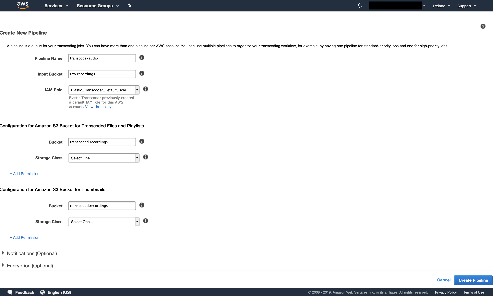
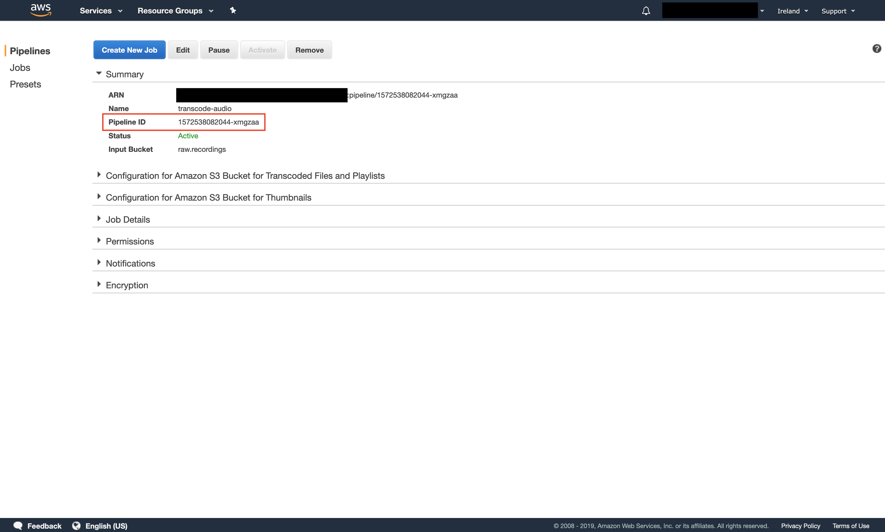
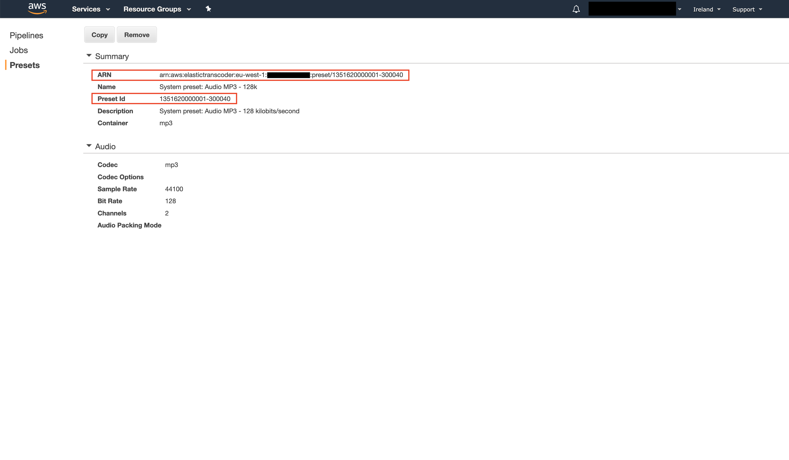
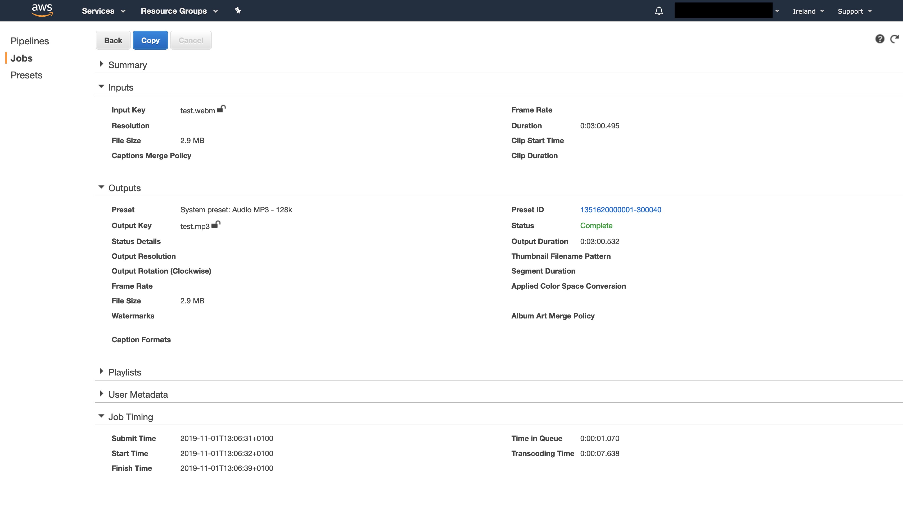
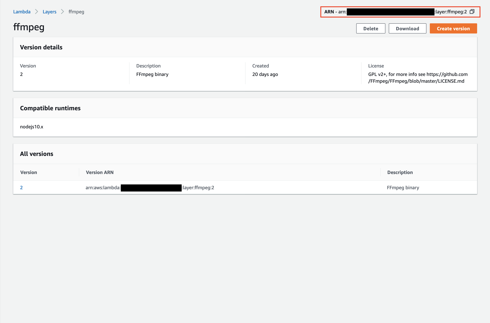
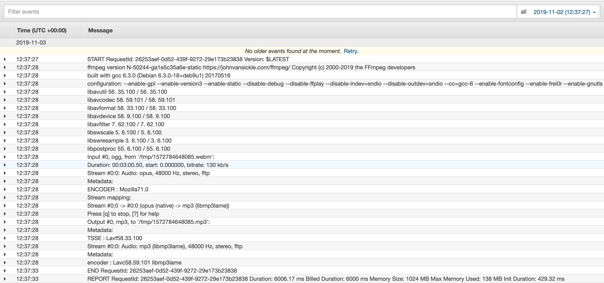
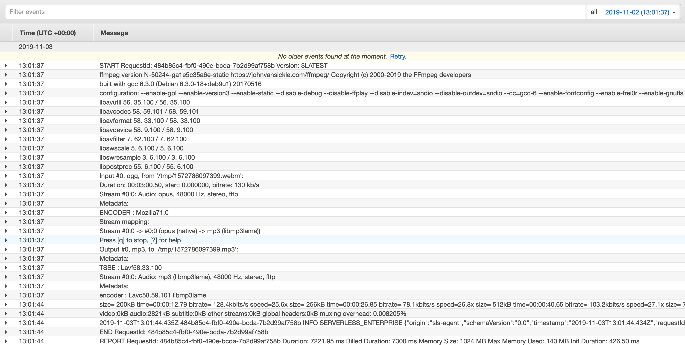
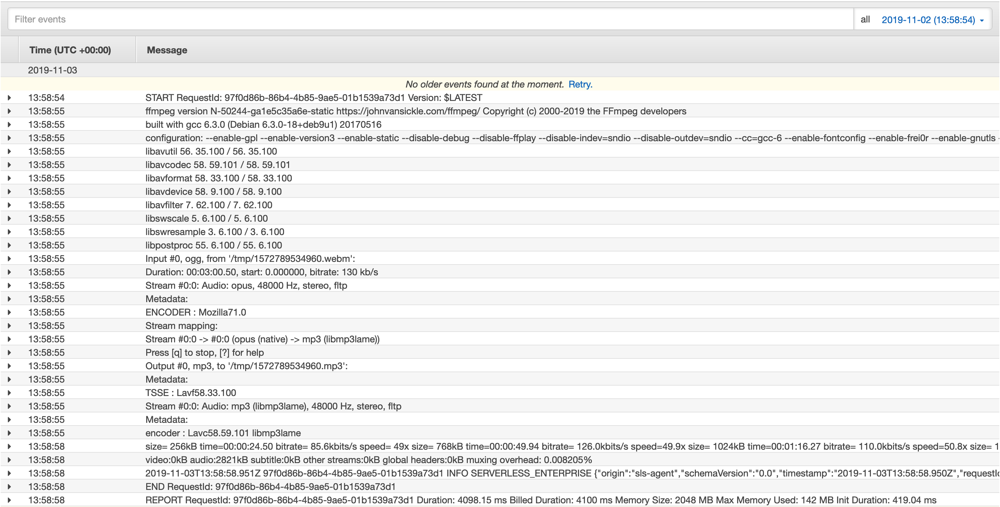

## TL;DR

For my side project I'm transforming WebM audio files into MP3. I initially started doing this with <a href="https://aws.amazon.com/elastictranscoder/" target="_blank" rel="noopener noreferrer">Amazon Elastic Transcoder</a>, which works pretty well. But after doing the same with <a href="https://www.ffmpeg.org/" target="_blank" rel="noopener noreferrer">FFmpeg</a> + <a href="https://docs.aws.amazon.com/lambda/latest/dg/configuration-layers.html" target="_blank" rel="noopener noreferrer">AWS Lambda Layers</a>, my initial testing shows that this implementation is around **3653 times cheaper**--at least for _short audio files_ that have a max duration of 3 min.

If you want to see the code for the audio transcoder, go to <a href="https://github.com/upstandfm/audio-transcoder" target="_blank" rel="noopener noreferrer">github.com/upstandfm/audio-transcoder</a>.

### Table of contents

- [Use case](#use-case)
- [What does transcoding even mean?](#what-does-transcoding-even-mean)
- [Transcoding audio](#transcoding-audio)
- [Using Amazon Elastic Transcoder](#using-amazon-elastic-transcoder)
- [Using FFmpeg + AWS Lambda Layers](#using-ffmpeg--aws-lambda-layers).
- [In closing](#in-closing)

## Use case

I recently started working on a new side project called <a href="https://www.upstand.fm/" target="_blank" rel="noopener noreferrer">Upstand FM</a>. It's a web app that allows you to record your voice, so other users of the app can listen to what you have to say.

In the app I use the <a href="https://developer.mozilla.org/en-US/docs/Web/API/MediaStream_Recording_API" target="_blank" rel="noopener noreferrer">MediaStream Recording API</a> (aka Media Recording API) to easily record audio from the user's input device. It works really well, and you don't have to use any external libraries!<br/>
There's one catch though--it only works in Firefox, Chrome and Opera. And at the time of this writing, it "sort of" works in Safari (it's hidden behind a feature flag and not all events are supported). Even though that's a bit disappointing, I'm okay with it for my use case.

So after I had built something functional that allowed me to record my voice, it turned out that the audio file I ended up with had to be _transcoded_ if I wanted to listen to it across a wide range of browsers and devices. And thus my adventure began.

## What does transcoding even mean?

Before I can answer that, we need to explore _what_ an audio file is.

We can think of an audio file like a stream of data elements wrapped in a container. This container is formally called a <a href="https://developer.mozilla.org/en-US/docs/Web/Media/Formats/Containers" target="_blank" rel="noopener noreferrer">media container format</a>, and it's basically a _file format_ (think file type) that can store different types of data elements (bits).<br/>
The container describes how this data "coexists" in a file. Some container formats only support audio, like <a href="https://en.wikipedia.org/wiki/WAV" target="_blank" rel="noopener noreferrer">WAVE</a> (usually referred to as WAV). And others support both audio and video, like <a href="https://www.webmproject.org/" target="_blank" rel="noopener noreferrer">WebM</a>.

So a container "wraps" data to store it in a file, but information can be stored in different ways. And we'll also want to _compress_ the data to optimize for storage and/or bandwith by _encoding_ it (converting it from one "form" to another).<br/>
This is where a _codec_ (**co**der/**dec**oder) comes into play. It handles all the processing that's required to _encode_ (compress) and _decode_ (decompress) the audio data.

Therefore, in order to define the format of an audio file (or a video file for that matter), we need both a container and a codec. For example, when the MPEG-1 Audio Layer 3 codec is used to store only audio data in an <a href="https://en.wikipedia.org/wiki/MPEG-4" target="_blank" rel="noopener noreferrer">MPEG-4</a> container, we get an <a href="https://en.wikipedia.org/wiki/MP3" target="_blank" rel="noopener noreferrer">MP3</a> file (even though it's technically still an MPEG format file).

> Fun fact: a container is not always required!
>
> "<a href="https://developer.mozilla.org/en-US/docs/Web/API/WebRTC_API " target="_blank" rel="noopener noreferrer">WebRTC</a> does not use a container at all. Instead, it streams the encoded audio and video tracks directly from one peer to another using `MediaStreamTrack` objects to represent each track."--from <a href="https://developer.mozilla.org/en-US/docs/Web/Media/Formats/Containers" target="_blank" rel="noopener noreferrer">MDN web docs</a>

So what does transcoding mean? It's the process of converting one encoding into another. And if we convert one container format into another, this process is called _transmuxing_.

There are a lot of codecs available, and each codec will have a different effect on the _quality_, _size_ and/or _compatibility_ of the audio file. If you'd like to learn more about audio codecs, I recommend reading the <a href="https://developer.mozilla.org/en-US/docs/Web/Media/Formats/Audio_codecs" target="_blank" rel="noopener noreferrer">Mozilla web audio codec guide</a>.

### Why do you need to transcode audio?

You might be wondering (like I was), if we can record audio directly in the browser, and immediately use the result in our app, why do we even have to transcode it?<br/>
The answer is to optimize for _compatibility_, because the Media Recording API _cannot record_ audio in all media formats.

For example, MP3 has good compatibility across browsers and devices for playback, but is _not_ supported by the Media Recording API. What formats are supported depend on the browser's specific implementation of the Media Recording API.

We can use the <a href="https://developer.mozilla.org/en-US/docs/Web/API/MediaRecorder/isTypeSupported" target="_blank" rel="noopener noreferrer">isTypeSupported</a> method to figure out if we can record in a specific media type, by providing it with a <a href="https://developer.mozilla.org/en-US/docs/Web/HTTP/Basics_of_HTTP/MIME_types" target="_blank" rel="noopener noreferrer">MIME</a> type.<br/>
We can run the following code in the web console (e.g. in Firefox or Chrome) to see it in action:

```js
MediaRecorder.isTypeSupported('audio/mpeg'); // false
```

Okay, MP3 isn't supported. Which format can we use to record in then? It looks like WebM is a good choice:

```js
MediaRecorder.isTypeSupported('audio/webm'); // true
```

Bonus round--you can even specify the codec in addition to the container:

```js
MediaRecorder.isTypeSupported('audio/webm;codecs=opus'); // true
```

So if we want to end up with MP3 files of the recordings, we need to transcode (and technically also transmux) the WebM audio files.

## Transcoding audio

We'll explore two implementations that both transform a WebM audio file into MP3:

- [Using Amazon Elastic Transcoder](#using-amazon-elastic-transcoder).
- [Using FFmpeg + AWS Lambda Layers](#using-ffmpeg--aws-lambda-layers).

For both implementations we'll use the <a href="https://serverless.com/" target="_blank" rel="noopener noreferrer">Serverless Framework</a>, and <a href="https://nodejs.org/en/" target="_blank" rel="noopener noreferrer">Node.js</a> to write the code for our <a href="https://aws.amazon.com/lambda/" target="_blank" rel="noopener noreferrer">Lambda</a> functions.

Make sure you have Node.js installed, and then use <a href="https://www.npmjs.com/" target="_blank" rel="noopener noreferrer">npm</a> to install the Serverless Framework globally:

```shell
npm i -G serverless
```

Additionally, we'll need two <a href="https://aws.amazon.com/s3/" target="_blank" rel="noopener noreferrer">S3</a> buckets to store audio files:

- An _input_ bucket for the "raw" WebM recordings.
- An _output_ bucket for the transcoded MP3 recordings.

## Using Amazon Elastic Transcoder

This is a fully managed and highly scalable AWS service, and we'll have to go through the following steps to get it up and running:

1. [Create a pipeline](#1-create-a-pipeline)
2. [Choose a preset](#2-choose-a-preset)
3. [Create an IAM Policy](#3-create-an-iam-policy)
4. [Create a Serverless project](#4-create-a-serverless-project)
5. [Implement the Lambda function](#5-implement-the-lambda-function)
6. [Release the Lambda function](#6-release-the-lambda-function)
7. [Trigger a transcoder job](#7-trigger-a-transcoder-job)

### 1. Create a pipeline

Navigate to the "Elastic Transcoder" service in the AWS web console. Select a region (for example Ireland), and click "Create New Pipeline".

<figure>
  
  <figcaption>Create a pipeline by providing a name, and input- and output buckets.</figcaption>
</figure>

> AWS asks you to provide a bucket for transcoded files and playlists, and thumbnails--you can use the same bucket for both.

Create the pipeline and take note of the "ARN" and "Pipeline ID". We'll need both to configure our Lambda function later on.

<figure>
  
  <figcaption>The created pipeline with its ID and ARN.</figcaption>
</figure>

### 2. Choose a preset

The pipeline we created in the previous step requires a <a href="https://docs.aws.amazon.com/elastictranscoder/latest/developerguide/working-with-presets.html" target="_blank" rel="noopener noreferrer">preset</a> to work. Presets contain settings we want to be applied during the transcoding process. And lucky for us, AWS already has system presets to create MP3 files.

In the web console, click on "Presets" and filter on the keyword "MP3". Select a preset and take note of its "ARN" and "Preset ID". We'll also need these to configure our Lambda function later on.

<figure>
  
  <figcaption>AWS system preset for MP3 (128k) files.</figcaption>
</figure>

### 3. Create an IAM Policy

AWS will already have created am IAM Role named `Elastic_Transcoder_Default_Role`. But in order for the pipeline to _read_ the objects from the input bucket, and _write_ objects to the output bucket, we need to make sure the role has the required permissions to do so.

Create a new _IAM Policy_ with the following configuration:

```json
{
  "Version": "2012-10-17",
  "Statement": [
    {
      "Sid": "VisualEditor0",
      "Effect": "Allow",
      "Action": "s3:GetObject",
      "Resource": "arn:aws:s3:::raw.recordings/*"
    },
    {
      "Sid": "VisualEditor1",
      "Effect": "Allow",
      "Action": "s3:PutObject",
      "Resource": "arn:aws:s3:::transcoded.recordings/*"
    },
    {
      "Sid": "VisualEditor2",
      "Effect": "Allow",
      "Action": "s3:ListBucket",
      "Resource": "arn:aws:s3:::transcoded.recordings"
    }
  ]
}
```

> Make sure the resource ARNs of your input- and output buckets are named correctly!

After the Policy has been created, attach it to `Elastic_Transcoder_Default_Role`.

### 4. Create a Serverless project

Create a new project named "audio-transcoder":

```shell
mkdir audio-transcoder
```

Move into this directory and create a `serverless.yml` file in the project root:

```shell
audio-transcoder
  └── serverless.yml # highlight-line
```

Add the following content to it:

```yml
service: audio-transcoder

provider:
  name: aws
  runtime: nodejs10.x

package:
  exclude:
    - ./*
    - ./**/*.test.js
  include:
    - node_modules
    - src
```

Add the Elastic Transcoder Pipeline ID, MP3 Preset ID and region (from [step 1](#1-create-a-pipeline) and [step 2](#2-choose-a-preset)) as environment variables:

```yml
service: audio-transcoder

provider:
  name: aws
  runtime: nodejs10.x
  # highlight-start
  environment:
    TRANSCODE_AUDIO_PIPELINE_ID: '1572538082044-xmgzaa' # See step 1
    TRANSCODER_MP3_PRESET_ID: '1351620000001-300040' # See step 2
    ELASTIC_TRANSCODER_REGION: 'eu-west-1' # Ireland
  # highlight-end

package:
  exclude:
    - ./*
    - ./**/*.test.js
  include:
    - node_modules
    - src
```

Use the Elastic Transcoder Pipeline ARN and MP3 Preset ARN (from [step 1](#1-create-a-pipeline) and [step 2](#2-choose-a-preset)) to configure the Lambda with the required IAM permissions, so it can create transcoder jobs:

```yml
service: audio-transcoder

provider:
  name: aws
  runtime: nodejs10.x
  environment:
    TRANSCODE_AUDIO_PIPELINE_ID: '1572538082044-xmgzaa'
    TRANSCODER_MP3_PRESET_ID: '1351620000001-300040'
    ELASTIC_TRANSCODER_REGION: 'eu-west-1'
  # highlight-start
  iamRoleStatements:
    - Effect: Allow
      Action:
        - elastictranscoder:CreateJob
      Resource:
        - YOUR_PIPELINE_ARN # Replace this with the ARN from step 1
        - YOUR_PRESET_ARN # Replace this with the ARN from step 2
  # highlight-end

package:
  exclude:
    - ./*
    - ./**/*.test.js
  include:
    - node_modules
    - src
```

Finally, add the Lambda function definition--this Lambda will be executed whenever an object is created in the input bucket:

```yml
service: audio-transcoder

provider:
  name: aws
  runtime: nodejs10.x
  environment:
    TRANSCODE_AUDIO_PIPELINE_ID: '1572538082044-xmgzaa'
    TRANSCODER_MP3_PRESET_ID: '1351620000001-300040'
    ELASTIC_TRANSCODER_REGION: 'eu-west-1'
  iamRoleStatements:
    - Effect: Allow
      Action:
        - elastictranscoder:CreateJob
      Resource:
        - YOUR_PIPELINE_ARN
        - YOUR_PRESET_ARN

package:
  exclude:
    - ./*
    - ./**/*.test.js
  include:
    - node_modules
    - src

# highlight-start
functions:
  transcodeToMp3:
    handler: src/handler.transcodeToMp3
    description: Transcode an audio file to MP3
    events:
      - s3:
          bucket: 'raw.recordings'
          event: 's3:ObjectCreated:*'
          existing: true
# highlight-end
```

This is the minimal configuration needed to get started. But if you'd like to learn more, I recommend you read the <a href="https://serverless.com/framework/docs/providers/aws/guide/serverless.yml/" target="_blank" rel="noopener noreferrer">Serverless manifest</a> and <a href="https://serverless.com/framework/docs/providers/aws/events/s3/" target="_blank" rel="noopener noreferrer">S3 event configuration</a> docs.

### 5. Implement the Lambda function

In order to match the Lambda function definition in the Serverless manifest, create a file named `handler.js` in `src`:

```shell
audio-transcoder
  ├── serverless.yml
  └── src
      └── handler.js # highlight-line
```

And in `src/handler.js` export a method named `transcodeToMp3`:

```js
'use strict';

module.exports.transcodeToMp3 = async () => {
  try {
    // Implementation goes here
  } catch (err) {
    console.log('Transcoder Error: ', err);
  }
};
```

In the previous step, we configured our Lambda to be executed whenever an object is created in the input bucket. This means that AWS will call the Lambda with an `event` message that contains a list of `Records`. And each `Record` will contain an `s3` object with information about the `s3:ObjectCreated` event:

```js
// "event" object:
{
  "Records":[
    // "Record" object:
    {
      "s3":{
        // Contains information about the "s3:ObjectCreated" event
      }
    }
  ]
}
```

The `s3` object will contain a property called `key`, which is the "name" of the file that was created in the input bucket.<br/>
For example, if we upload a file named `test.wemb` to the S3 bucket, the value of `key` will be the (URL encoded!) string `test.webm`.<br />
You can see the entire event message structure in the <a href="https://docs.aws.amazon.com/AmazonS3/latest/dev/notification-content-structure.html" target="_blank" rel="noopener noreferrer">AWS S3 docs</a>.

Also be aware that you can get **more than one** `Record`--always process all of them:

```js
'use strict';

// highlight-start
module.exports.transcodeToMp3 = async event => {
  // highlight-end
  try {
    // highlight-start
    for (const Record of event.Records) {
      const { s3 } = Record;
      if (!s3) {
        continue;
      }
      const { object: s3Object = {} } = s3;
      const { key } = s3Object;
      if (!key) {
        continue;
      }
      // Keys are sent as URI encoded strings
      // If keys are not decoded, they will not be found in their buckets
      const decodedKey = decodeURIComponent(key);
      // We'll use the "decodedKey" to tell Amazon Elastic Transcoder
      // which file to transcode
      // highlight-end
    }
  } catch (err) {
    console.log('Transcoder Error: ', err);
  }
};
```

Now we can initialize the transcoder client:

```js
'use strict';

// highlight-start
const ElasticTranscoder = require('aws-sdk/clients/elastictranscoder');
// highlight-end

// highlight-start
const {
  ELASTIC_TRANSCODER_REGION,
  TRANSCODE_AUDIO_PIPELINE_ID,
  TRANSCODER_MP3_PRESET_ID
} = process.env;
// highlight-end

// highlight-start
const transcoderClient = new ElasticTranscoder({
  region: ELASTIC_TRANSCODER_REGION
});
// highlight-end

module.exports.transcodeToMp3 = async event => {
  try {
    for (const Record of event.Records) {
      const { s3 } = Record;
      if (!s3) {
        continue;
      }
      const { object: s3Object = {} } = s3;
      const { key } = s3Object;
      if (!key) {
        continue;
      }
      // Keys are sent as URI encoded strings
      // If keys are not decoded, they will not be found in their buckets
      const decodedKey = decodeURIComponent(key);
      // We'll use the "decodedKey" to tell Amazon Elastic Transcoder
      // which file to transcode
    }
  } catch (err) {
    console.log('Transcoder Error: ', err);
  }
};
```

And schedule a transcoder job for every created S3 object in the input bucket:

```js
'use strict';

const ElasticTranscoder = require('aws-sdk/clients/elastictranscoder');

const {
  ELASTIC_TRANSCODER_REGION,
  TRANSCODE_AUDIO_PIPELINE_ID,
  TRANSCODER_MP3_PRESET_ID
} = process.env;

const transcoderClient = new ElasticTranscoder({
  region: ELASTIC_TRANSCODER_REGION
});

module.exports.transcodeToMp3 = async event => {
  try {
    for (const Record of event.Records) {
      const { s3 } = Record;
      if (!s3) {
        continue;
      }
      const { object: s3Object = {} } = s3;
      const { key } = s3Object;
      if (!key) {
        continue;
      }
      // Keys are sent as URI encoded strings
      // If keys are not decoded, they will not be found in their buckets
      const decodedKey = decodeURIComponent(key);

      // highlight-start
      await transcoderClient
        .createJob({
          PipelineId: TRANSCODE_AUDIO_PIPELINE_ID,
          Input: {
            Key: decodedKey
          },
          Outputs: [
            {
              Key: decodedKey.replace('webm', 'mp3'),
              PresetId: TRANSCODER_MP3_PRESET_ID
            }
          ]
        })
        .promise();
      // highlight-end
    }
  } catch (err) {
    console.log('Transcoder Error: ', err);
  }
};
```

You can read more about the `createJob` API in the <a href="https://docs.aws.amazon.com/AWSJavaScriptSDK/latest/AWS/ElasticTranscoder.html#createJob-property" target="_blank" rel="noopener noreferrer">AWS JavaScript SDK</a> docs.

### 6. Release the Lambda function

In order to upload the Lambda to AWS, make sure you have your <a href="https://docs.aws.amazon.com/cli/latest/userguide/cli-configure-files.html" target="_blank" rel="noopener noreferrer">credentials configured</a>, and then run the following command from the project root:

```shell
sls deploy --region eu-west-1 --stage prod
```

### 7. Trigger a transcoder job

With everything up and running, we can now upload a WebM audio file to the input bucket. Navigate to the "S3" service in AWS web console:

- Select your input bucket.
- Click "Upload".
- Add a WebM file.
- Click on "Upload" again.

> If you don't have a WebM file, but would like to try this out, you can use my <a href="./audio/test.webm" download>test.webm</a> file--it's a 3 minute (2,9 MB) recording of a podcast I was listening to.

This action will trigger an `s3:ObjectCreated` event and AWS will execute the Lambda function we deployed in the previous step, which will schedule a transcoder job.

To get more details about a scheduled job, navigate to the "Elastic Transcoder" service in the AWS web console. Click on "Jobs", select your pipeline and click "Search".

You should see a job, select it for more information.

<figure>
  
  <figcaption>Information about the created pipeline job.</figcaption>
</figure>

If it has status "Complete", there should be a file named `test.mp3` in the output bucket!

## Using FFmpeg + AWS Lambda Layers

FFmpeg is a cross-platform solution that can be used to convert audio and video files. And since it's a binary, we'll use a Lambda Layer to execute it from our Lambda function.

Because we're still converting a WebM audio file to MP3 whenever a file is uploaded to our input bucket, we can reuse our `audio-transcoder` project by making a few changes:

- Replace Amazon Elastic Transcoder with FFmpeg.
- Retrieve the WebM audio file from the input bucket, whenever a file is uploaded.
- Convert the retrieved WebM file to MP3 using FFmpeg.
- Write the converted MP3 file to the output bucket.

We'll have to go through the following steps to make this happen:

1. [Create and publish the FFmpeg Lambda Layer](#1-create-and-publish-the-ffmpeg-lambda-layer)
2. [Update the Serverless manifest](#2-update-the-serverless-manifest)
3. [Update the Lambda function](#3-update-the-lambda-function)
4. [Release the updated Lambda function](#4-release-the-updated-lambda-function)
5. [Trigger another transcoder job](#5-trigger-another-transcoder-job)
6. [Optimizing the Lambda function](#6-optimizing-the-lambda-function)

### 1. Create and publish the FFmpeg Lambda Layer

Lambda Layers allow us to "pull in" extra dependencies into our Lambda functions. A layer is basically a ZIP archive that contains some code. And in order to use a layer, we first must create and publish one.

After we publish a layer, we can configure any Lambda function to use it. AWS will then extract the layer to a special directory called `/opt`, and the Lambda function runtime will be able to execute it.

> "Note that a Lambda function can use up to 5 layers at a time."--from <a href="https://docs.aws.amazon.com/lambda/latest/dg/configuration-layers.html" target="_blank" rel="noopener noreferrer">Lambda Layers docs</a>

The Serverless Framework makes it very easy to work with layers. To get started, create a new project named "lambda-layers":

```shell
mkdir lambda-layers
```

Move to this directory and create a `serverless.yml` file in your project root:

```shell
lambda-layers
  └── serverless.yml # highlight-line
```

Add the following content to it:

```yml
service: lambda-layers

provider:
  name: aws
  runtime: nodejs10.x

package:
  exclude:
    - ./*
  include:
    - layers

layers:
  ffmpeg:
    path: layers
    description: FFmpeg binary
    compatibleRuntimes:
      - nodejs10.x
    licenseInfo: GPL v2+, for more info see https://github.com/FFmpeg/FFmpeg/blob/master/LICENSE.md
```

The layer is named `ffmpeg` and the `path` propery dictates that the layer code will reside in a directory named `layers`. Match this structure in the project:

```shell
mkdir layers
```

Move into this directory and download a static build of FFmpeg from <a href="https://johnvansickle.com/ffmpeg/" target="_blank" rel="noopener noreferrer">johnvansickle.com/ffmpeg</a>.

> These FFmpeg builds are all compatible with Amazon Linux 2--the operating system on which Lambda runs when the `Node.js 10.x` <a href="https://docs.aws.amazon.com/lambda/latest/dg/lambda-runtimes.html" target="_blank" rel="noopener noreferrer">runtime</a> is used.

Use the recommended `ffmpeg-git-amd64-static.tar.xz` master build:

```shell
curl -O https://johnvansickle.com/ffmpeg/builds/ffmpeg-git-amd64-static.tar.xz
```

Extract the files from the downloaded archive:

```shell
tar -xvf ffmpeg-git-amd64-static.tar.xz
```

Remove the archive:

```shell
rm ffmpeg-git-amd64-static.tar.xz
```

And rename the extracted directory to `ffmpeg`, so it matches the configured layer name in the manifest:

```shell
mv ffmpeg-git-20191029-amd64-static ffmpeg
```

You should now have the following folder structure:

```shell
lambda-layers
  ├── layers # highlight-line
  │   └── ffmpeg # highlight-line
  │       ├── GPLv3.txt
  │       ├── ffmpeg # highlight-line
  │       ├── ffprobe
  │       ├── manpages
  │       ├── model
  │       ├── qt-faststart
  │       └── readme.txt
  └── serverless.yml
```

Now publish the FFmpeg layer by running the following command from the project root:

```shell
sls deploy --region eu-west-1 --stage prod
```

When Serverless finishes deploying, navigate to the "Lambda" service in the AWS web console, and click on "Layers". Here you should see the published FFmpeg layer. Click on it and take note of the "ARN", we'll need it to configure our Lambda function in the next step.

<figure>
  
  <figcaption>Information about the published FFmpeg layer.</figcaption>
</figure>

### 2. Update the Serverless manifest

> Note that we're now modifying the manifest file of the "audio-transcoder".

First modify the environment variables, and add the names of the input- and output buckets:

```yml
service: audio-transcoder

provider:
  name: aws
  runtime: nodejs10.x
  environment:
    S3_INPUT_BUCKET_NAME: 'raw.recordings' # highlight-line
    S3_OUTPUT_BUCKET_NAME: 'transcoded.recordings' # highlight-line
  iamRoleStatements:
    - Effect: Allow
      Action:
        - elastictranscoder:CreateJob
      Resource:
        - YOUR_PIPELINE_ARN
        - YOUR_PRESET_ARN

package:
  exclude:
    - ./*
    - ./**/*.test.js
  include:
    - node_modules
    - src

functions:
  transcodeToMp3:
    handler: src/handler.transcodeToMp3
    description: Transcode an audio file to MP3
    events:
      - s3:
          bucket: 'raw.recordings'
          event: 's3:ObjectCreated:*'
          existing: true
```

Then we the IAM permissions, so the Lambda function can read from the input bucket, and write to the output bucket:

```yml
service: audio-transcoder

provider:
  name: aws
  runtime: nodejs10.x
  environment:
    S3_INPUT_BUCKET_NAME: 'raw.recordings'
    S3_OUTPUT_BUCKET_NAME: 'transcoded.recordings'
  iamRoleStatements:
    # highlight-start
    - Effect: Allow
      Action:
        - s3:GetObject
      Resource: arn:aws:s3:::raw.recordings/*
    - Effect: Allow
      Action:
        - s3:PutObject
      Resource: arn:aws:s3:::transcoded.recordings/*
    # highlight-end

package:
  exclude:
    - ./*
    - ./**/*.test.js
  include:
    - node_modules
    - src

functions:
  transcodeToMp3:
    handler: src/handler.transcodeToMp3
    description: Transcode an audio file to MP3
    events:
      - s3:
          bucket: 'raw.recordings'
          event: 's3:ObjectCreated:*'
          existing: true
```

And configure the Lambda function to use the FFmpeg layer with the ARN from the [previous step](#1-create-and-publish-the-ffmpeg-lambda-layer):

```yml
service: audio-transcoder

provider:
  name: aws
  runtime: nodejs10.x
  environment:
    S3_INPUT_BUCKET_NAME: 'raw.recordings'
    S3_OUTPUT_BUCKET_NAME: 'transcoded.recordings'
  iamRoleStatements:
    - Effect: Allow
      Action:
        - s3:GetObject
      Resource: arn:aws:s3:::raw.recordings/*
    - Effect: Allow
      Action:
        - s3:PutObject
      Resource: arn:aws:s3:::transcoded.recordings/*

package:
  exclude:
    - ./*
    - ./**/*.test.js
  include:
    - node_modules
    - src

functions:
  transcodeToMp3:
    handler: src/handler.transcodeToMp3
    description: Transcode an audio file to MP3
    events:
      - s3:
          bucket: 'raw.recordings'
          event: 's3:ObjectCreated:*'
          existing: true
    # highlight-start
    layers:
      - YOUR_FFMPEG_LAYER_ARN # Replace this with the ARN from step 1
    # highlight-end
```

### 3. Update the Lambda function

Since we have to read from the input bucket, and write to the output bucket, replace the Elastic Transcoder client with the S3 client:

```js
'use strict';

// highlight-start
const S3 = require('aws-sdk/clients/s3');
const { S3_INPUT_BUCKET_NAME, S3_OUTPUT_BUCKET_NAME } = process.env;
const s3Client = new S3();
// highlight-end

module.exports.transcodeToMp3 = async event => {
  try {
    for (const Record of event.Records) {
      const { s3 } = Record;
      if (!s3) {
        continue;
      }
      const { object: s3Object = {} } = s3;
      const { key } = s3Object;
      if (!key) {
        continue;
      }
      // Keys are sent as URI encoded strings
      // If keys are not decoded, they will not be found in their buckets
      const decodedKey = decodeURIComponent(key);

      await transcoderClient
        .createJob({
          PipelineId: TRANSCODE_AUDIO_PIPELINE_ID,
          Input: {
            Key: decodedKey
          },
          Outputs: [
            {
              Key: decodedKey.replace('webm', 'mp3'),
              PresetId: TRANSCODER_MP3_PRESET_ID
            }
          ]
        })
        .promise();
    }
  } catch (err) {
    console.log('Transcoder Error: ', err);
  }
};
```

Then use the `decodedKey` to get the WebM recording from the input bucket:

```js
'use strict';

const S3 = require('aws-sdk/clients/s3');
const { S3_INPUT_BUCKET_NAME, S3_OUTPUT_BUCKET_NAME } = process.env;
const s3Client = new S3();

module.exports.transcodeToMp3 = async event => {
  try {
    for (const Record of event.Records) {
      const { s3 } = Record;
      if (!s3) {
        continue;
      }
      const { object: s3Object = {} } = s3;
      const { key } = s3Object;
      if (!key) {
        continue;
      }
      // Keys are sent as URI encoded strings
      // If keys are not decoded, they will not be found in their buckets
      const decodedKey = decodeURIComponent(key);

      // highlight-start
      const webmRecording = await s3Client
        .getObject({
          Bucket: S3_INPUT_BUCKET_NAME,
          Key: decodedKey
        })
        .promise();
      // highlight-end
    }
  } catch (err) {
    console.log('Transcoder Error: ', err);
  }
};
```

The S3 client returns an object that contains a `Body` property. The value of `Body` is a blob, which we'll feed to the FFmpeg layer to convert to an MP3. We'll create a helper module called `ffmpeg` to do this. In `src` create a file named `ffmpeg.js`:

```shell
audio-transcoder
  ├── serverless.yml
  └── src
      ├── ffmpeg.js # highlight-line
      └── handler.js
```

And export an object with a method called `convertWebmToMp3`, which receives the WebM blob as an argument:

```js
'use strict';

module.exports = {
  convertWebmToMp3(webmBlob) {
    // Implementation goes here
  }
};
```

This module will spawn a <a href="https://nodejs.org/api/child_process.html#child_process_child_process_spawnsync_command_args_options" target="_blank" rel="noopener noreferrer">synchronous child process</a> that allows us to execute the `ffmpeg` "command" (provided by the FFmpeg layer):

```js
'use strict';

const { spawnSync } = require('child_process'); // highlight-line

module.exports = {
  convertWebmToMp3(webmBlob) {
    // highlight-start
    spawnSync(
      '/opt/ffmpeg/ffmpeg', // "/opt/:LAYER_NAME/:BINARY_NAME"
      [
        /* FFmpeg command arguments go here */
      ],
      { stdio: 'inherit' }
    );
    // highlight-end
  }
};
```

The `ffmpeg` command requires the file system to do its magic. And we'll use a "special" directory called `/tmp` for this.

> The `/tmp` directory allows you to **temporarily** store up to <a href="https://docs.aws.amazon.com/lambda/latest/dg/limits.html" target="_blank" rel="noopener noreferrer">512 MB</a>.

First we'll write the WebM blob to `/tmp` so ffmpeg can read it, and then we'll tell FFmpeg to write the produced MP3 file to the same directory:

```js
'use strict';

const { spawnSync } = require('child_process');
const { writeFileSync } = require('fs'); // highlight-line

module.exports = {
  convertWebmToMp3(webmBlob) {
    // highlight-start
    const now = Date.now();
    const input = `/tmp/${now}.webm`;
    const output = `/tmp/${now}.mp3`;
    // highlight-end

    // highlight-start
    writeFileSync(input, webmBlob);
    // highlight-end

    // highlight-start
    spawnSync('/opt/ffmpeg/ffmpeg', ['-i', input, output], {
      stdio: 'inherit'
    });
    // highlight-end
  }
};
```

Now we can read the produced MP3 file from disk, clean `/tmp`, and return the MP3 blob:

```js
'use strict';

const { spawnSync } = require('child_process');
const { readFileSync, writeFileSync, unlinkSync } = require('fs'); // highlight-line

module.exports = {
  convertWebmToMp3(webmBlob) {
    const now = Date.now();
    const input = `/tmp/${now}.webm`;
    const output = `/tmp/${now}.mp3`;

    writeFileSync(input, webmBlob);

    // highlight-start
    spawnSync('/opt/ffmpeg/ffmpeg', ['-i', input, output], {
      stdio: 'inherit'
    });
    // highlight-end

    // highlight-start
    const mp3Blob = readFileSync(output);
    // highlight-end

    // highlight-start
    // Clean all temporary files
    unlinkSync(input);
    unlinkSync(output);
    // highlight-end

    // highlight-start
    return mp3Blob;
    // highlight-end
  }
};
```

Finally, we'll use the MP3 blob to write it to the output bucket:

```js
'use strict';

const S3 = require('aws-sdk/clients/s3');
const ffmpeg = require('./ffmpeg'); // highlight-line
const { S3_INPUT_BUCKET_NAME, S3_OUTPUT_BUCKET_NAME } = process.env;
const s3Client = new S3();

module.exports.transcodeToMp3 = async event => {
  try {
    for (const Record of event.Records) {
      const { s3 } = Record;
      if (!s3) {
        continue;
      }
      const { object: s3Object = {} } = s3;
      const { key } = s3Object;
      if (!key) {
        continue;
      }
      // Keys are sent as URI encoded strings
      // If keys are not decoded, they will not be found in their buckets
      const decodedKey = decodeURIComponent(key);

      const webmRecording = await s3Client
        .getObject({
          Bucket: S3_INPUT_BUCKET_NAME,
          Key: decodedKey
        })
        .promise();

      // highlight-start
      const mp3Blob = ffmpeg.convertWebmToMp3(webmRecording.Body);
      await s3Client
        .putObject({
          Bucket: S3_OUTPUT_BUCKET_NAME,
          Key: decodedKey.replace('webm', 'mp3'),
          ContentType: 'audio/mpeg',
          Body: mp3Blob
        })
        .promise();
      // highlight-end
    }
  } catch (err) {
    console.log('Transcoder Error: ', err);
  }
};
```

### 4. Release the updated Lambda function

Run the same command like before from the project root:

```shell
sls deploy --region eu-west-1 --stage prod
```

### 5. Trigger another transcoder job

When Serverless is done deploying, upload a WebM file to the input bucket. But why does the output bucket remain empty? Where's the MP3 file?

Lets find out why this is happening by checking the Lambda function's log files in the AWS web console:

- Go to the "Lambda" service.
- Click on the "audio-transcoder-prod-transcodeToMp3" function.
- Click on the "Monitoring" tab.
- Click the "View logs in CloudWatch" button.
- Select the latest log group.

Here you should see the logs of the Lambda function:

<figure>
  
  <figcaption>The Lambda function stops executing after about 6 seconds.</figcaption>
</figure>

The logs tell us that FFmpeg is executing, but that it doesn't complete! In the middle of the transcoding process the logs just say "END", and on the final line we see that the Lambda had a duration of `6006.17 ms`.

What's happening? Our Lambda function takes "too long" to finish executing. By default the Lambda has a timeout of 6 seconds (at the time of this writing it can be set to a maximum value of <a href="https://docs.aws.amazon.com/lambda/latest/dg/limits.html" target="_blank" rel="noopener noreferrer">900 seconds</a>).

In other words, because of the default timeout, after 6 seconds our Lambda is still not done transcoding and AWS _terminates_ it. Therefore we must optimize our Lambda function!

### 6. Optimizing the Lambda function

First lets just set the timeout to a larger value (for example 3 minutes) so we can see how long it would actually take to complete the transcoding process:

```yml
service: audio-transcoder

provider:
  name: aws
  runtime: nodejs10.x
  environment:
    S3_INPUT_BUCKET_NAME: 'raw.recordings'
    S3_OUTPUT_BUCKET_NAME: 'transcoded.recordings'
  iamRoleStatements:
    - Effect: Allow
      Action:
        - s3:GetObject
      Resource: arn:aws:s3:::raw.recordings/*
    - Effect: Allow
      Action:
        - s3:PutObject
      Resource: arn:aws:s3:::transcoded.recordings/*

package:
  exclude:
    - ./*
    - ./**/*.test.js
  include:
    - node_modules
    - src

functions:
  transcodeToMp3:
    handler: src/handler.transcodeToMp3
    description: Transcode an audio file to MP3
    timeout: 180 # highlight-line
    events:
      - s3:
          bucket: 'raw.recordings'
          event: 's3:ObjectCreated:*'
          existing: true
    layers:
      - YOUR_FFMPEG_LAYER_ARN
```

Deploy again, and when Serverless is done, upload another WebM file, and check the logs:

<figure>
  
  <figcaption>The Lambda function finishes executing after about 7 seconds.</figcaption>
</figure>

This time we see FFmpeg completed the transcoding process, and that the Lambda had a duration of `7221.95 ms`. If we check the output bucket now, we'll see the MP3 file!

#### Optimizing further

This isn't bad, but we can do better! Something that's very important when working with Lambda, is to _always_ performance test your functions--always make sure that a Lambda function has the _optimum_ memory size configured.

This is important, because when you choose a higher memory setting, AWS will also give you an equivalent CPU boost! And this will usually positively impact the function's runtime duration.

> In general, a Lambda function's **memory** and **duration** are the main factors that affect its costs.

By default a Lambda function has a memory setting of `1024 MB`, so lets double it and compare results:

```yml
service: audio-transcoder

provider:
  name: aws
  runtime: nodejs10.x
  environment:
    S3_INPUT_BUCKET_NAME: 'raw.recordings'
    S3_OUTPUT_BUCKET_NAME: 'transcoded.recordings'
  iamRoleStatements:
    - Effect: Allow
      Action:
        - s3:GetObject
      Resource: arn:aws:s3:::raw.recordings/*
    - Effect: Allow
      Action:
        - s3:PutObject
      Resource: arn:aws:s3:::transcoded.recordings/*

package:
  exclude:
    - ./*
    - ./**/*.test.js
  include:
    - node_modules
    - src

functions:
  transcodeToMp3:
    handler: src/handler.transcodeToMp3
    description: Transcode an audio file to MP3
    timeout: 180
    memorySize: 2048 # highlight-line
    events:
      - s3:
          bucket: 'raw.recordings'
          event: 's3:ObjectCreated:*'
          existing: true
    layers:
      - YOUR_FFMPEG_LAYER_ARN
```

Deploy again, and when Serverless is done, upload another WebM file and check the logs:

<figure>
  
  <figcaption>The Lambda function with 2048 MB of memory completes in about 4 seconds.</figcaption>
</figure>

Great, it's even faster now! Does this mean we can just keep increasing the memory and reap the benefits? Sadly no--there's a tipping point where increasing the memory wont make it run faster.

For example, increasing the memory to `3008 MB` (the maximum <a href="https://docs.aws.amazon.com/lambda/latest/dg/limits.html" target="_blank" rel="noopener noreferrer">memory limit</a> at the time of this writing) will result in almost the same runtime duration:

##### 2048 MB

| Execution run | Duration     | Billed Duration | Cold Start Duration |
| ------------- | ------------ | --------------- | ------------------- |
| 1             | `3775.63 ms` | `3800 ms`       | `392.59 ms`         |
| 2             | `3604.71 ms` | `3700 ms`       | -                   |
| 3             | `3682.62 ms` | `3700 ms`       | -                   |
| 4             | `3677.14 ms` | `3700 ms`       | -                   |
| 5             | `3725.77 ms` | `3800 ms`       | -                   |

##### 3008 MB

| Execution run | Duration     | Billed Duration | Cold Start Duration |
| ------------- | ------------ | --------------- | ------------------- |
| 1             | `4125.12 ms` | `4200 ms`       | `407.92 ms`         |
| 2             | `3767.79 ms` | `3800 ms`       | -                   |
| 3             | `3736.06 ms` | `3800 ms`       | -                   |
| 4             | `3662.68 ms` | `3700 ms`       | -                   |
| 5             | `3717.01 ms` | `3800 ms`       | -                   |

## In closing

In this post I showed you a way to implement "serverless audio transcoding".
