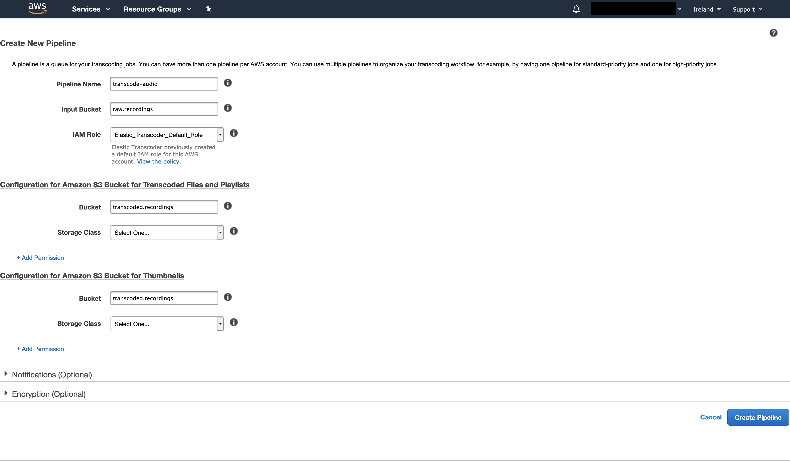
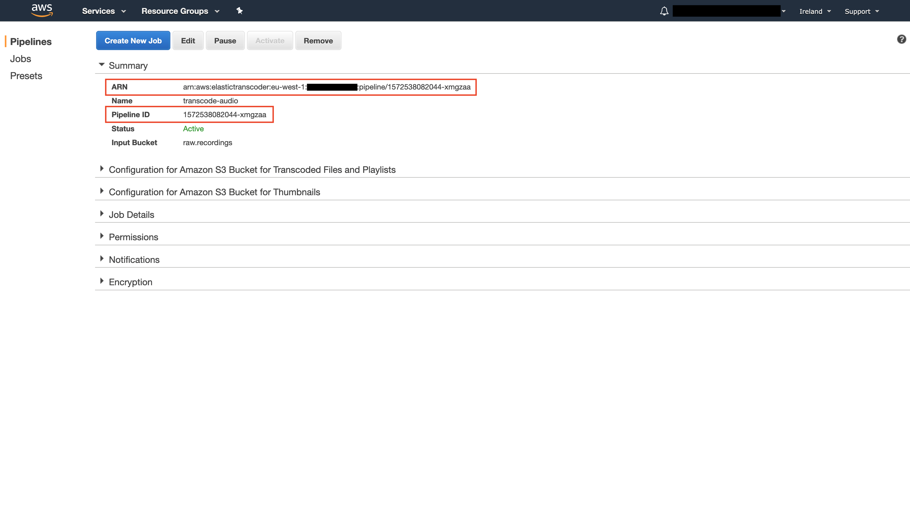

## TL;DR

For my side project I'm transcoding WebM audio files into MP3. I initially started doing this with <a href="https://aws.amazon.com/elastictranscoder/" target="_blank" rel="noopener noreferrer">Amazon Elastic Transcoder</a>, which works pretty well. But after transcoding the same audio files with <a href="https://www.ffmpeg.org/" target="_blank" rel="noopener noreferrer">FFmpeg</a> + <a href="https://docs.aws.amazon.com/lambda/latest/dg/configuration-layers.html" target="_blank" rel="noopener noreferrer">AWS Lambda Layers</a>, my initial testing shows that this implementation is around **3653 times cheaper** than Amazon Elastic Transcoder--at least for _short audio files_ that have a maximum duration of 3 minutes.

If you want to see the code for the audio transcoder, go to <a href="https://github.com/upstandfm/audio-transcoder" target="_blank" rel="noopener noreferrer">github.com/upstandfm/audio-transcoder</a>.

### Table of contents

- [Use case](#use-case)
- [What does transcoding even mean?](#what-does-transcoding-even-mean)
- [Transcoding audio](#transcoding-audio)
- [In closing](#in-closing)

## Use case

I recently started working on a new side project called <a href="https://www.upstand.fm/" target="_blank" rel="noopener noreferrer">Upstand FM</a>. It's a web app that allows you to record your voice, so other users of the app can listen to what you have to say.

In the app I used the <a href="https://developer.mozilla.org/en-US/docs/Web/API/MediaStream_Recording_API" target="_blank" rel="noopener noreferrer">MediaStream Recording API</a> (aka Media Recording API) to easily record audio from the user's input device. It works really well, and you don't have to use any external libraries!<br/>
What's the catch then? Well, it only works in Firefox, Chrome and Opera. Hopefully it will soon also work in Safari--at the time of this writing you have to enable it via an experimental feature flag called "MediaRecorder", but not all events are supported. This means that the implementation you got working in Firefox or Chrome, probably won't work in Safari.<br/>
Even though that's a bit disappointing, I was okay with it for my use case.

## What does transcoding even mean?

Before I can answer that, we need to explore _what_ an audio file is.

We can think of an audio file like a stream of data elements wrapped in a container. This container is formally called a <a href="https://developer.mozilla.org/en-US/docs/Web/Media/Formats/Containers" target="_blank" rel="noopener noreferrer">media container format</a>, and it's basically a _file format_ (think file type) that can store different types of data elements (bits).<br/>
The container describes how this data "coexists" in a file. Some container formats only support audio, like <a href="https://en.wikipedia.org/wiki/WAV" target="_blank" rel="noopener noreferrer">WAVE</a> (usually referred to as WAV). And others support both audio and video, like <a href="https://www.webmproject.org/" target="_blank" rel="noopener noreferrer">WebM</a>.

So a container "wraps" data to store it in a file, but information can be stored in different ways. And we'll also want to _compress_ the data to optimize for storage and/or bandwith by _encoding_ it (converting it from one "form" to another).<br/>
This is where a _codec_ (**co**der/**dec**oder) comes into play. It handles all the processing that's required to _encode_ (compress) and _decode_ (decompress) the audio data.

Therefore, in order to define the format of an audio file (or video file for that matter), we need both a container and a codec. For example, when the MPEG-1 Audio Layer 3 codec is used to store only audio data in an <a href="https://en.wikipedia.org/wiki/MPEG-4" target="_blank" rel="noopener noreferrer">MPEG-4</a> container, we get an <a href="https://en.wikipedia.org/wiki/MP3" target="_blank" rel="noopener noreferrer">MP3</a> file (even though it's technically still an MPEG format file).

> Fun fact: a container is not always required!
>
> "<a href="https://developer.mozilla.org/en-US/docs/Web/API/WebRTC_API " target="_blank" rel="noopener noreferrer">WebRTC</a> does not use a container at all. Instead, it streams the encoded audio and video tracks directly from one peer to another using `MediaStreamTrack` objects to represent each track."--from <a href="https://developer.mozilla.org/en-US/docs/Web/Media/Formats/Containers" target="_blank" rel="noopener noreferrer">MDN web docs</a>

So what does _transcoding_ mean? It's the process of converting one encoding into another. And if we convert one container format into another, this process is called _transmuxing_.

There are a lot of codecs available, and each codec will have a different effect on the _quality_, _size_ and/or _compatibility_ of the audio file. If you'd like to learn more about audio codecs, I recommend reading the <a href="https://developer.mozilla.org/en-US/docs/Web/Media/Formats/Audio_codecs" target="_blank" rel="noopener noreferrer">Mozilla web audio codec guide</a>.

### Why do you need to transcode audio?

You might be wondering (like I was), if we can record audio directly in the browser, and immediately use the result in our app, why do we even have to transcode it?<br/>
The answer is to optimize for _compatibility_, because the Media Recording API _cannot record_ audio in all media formats.

For example, MP3 has good compatibility across browsers and devices for playback, but is _not_ supported by the Media Recording API. What formats are supported depend on the browser's specific implementation of the Media Recording API.

We can use the <a href="https://developer.mozilla.org/en-US/docs/Web/API/MediaRecorder/isTypeSupported" target="_blank" rel="noopener noreferrer">isTypeSupported</a> method to figure out if we can record in a specific media type, by providing it with a <a href="https://developer.mozilla.org/en-US/docs/Web/HTTP/Basics_of_HTTP/MIME_types" target="_blank" rel="noopener noreferrer">MIME</a> type.<br/>
We can run the following code in the web console (e.g. in Firefox or Chrome) to see it in action:

```js
MediaRecorder.isTypeSupported('audio/mpeg'); // false
```

Okay, MP3 is indeed not supported. Which format can we use to record in then? It looks like WebM is a good choice:

```js
MediaRecorder.isTypeSupported('audio/webm'); // true
```

Bonus round--you can even specify the codec in addition to the container:

```js
MediaRecorder.isTypeSupported('audio/webm;codecs=opus'); // true
```

So if we want to end up with MP3 files of the recordings, we need to transcode (and technically also transmux) the WebM files.

## Transcoding audio

We'll explore two implementations that both transcode a WebM audio file into MP3:

- [Using Amazon Elastic Transcoder](#amazon-elastic-transcoder).
- [Using FFmpeg + AWS Lambda Layers](#ffmpeg--aws-lambda-layers).

For both implementations we'll use the <a href="https://serverless.com/" target="_blank" rel="noopener noreferrer">Serverless Framework</a>, and <a href="https://nodejs.org/en/" target="_blank" rel="noopener noreferrer">Node.js</a> to write the code for out <a href="https://aws.amazon.com/lambda/" target="_blank" rel="noopener noreferrer">Lambda</a> functions. Additionally, we'll need two <a href="https://aws.amazon.com/s3/" target="_blank" rel="noopener noreferrer">S3</a> buckets to store audio files:

- An _input_ bucket for the "raw" WebM recordings.
- An _output_ bucket for the transcoded MP3 recordings.

### Amazon Elastic Transcoder

This is a fully managed and highly scalable AWS service to transcode audio and video files. We'll have to go through the following steps to get it up and running:

1. [Create an Elastic Transcoder pipeline](#create-an-elastic-transcoder-pipeline)
2. [Create an Elastic Transcoder IAM Policy](#create-an-elastic-transcoder-iam-policy)
3. [Setup a new Node.js project](#setup-a-new-nodejs-project)
4. [Create the Serverless Manifest](#create-the-serverless-manifest)
5. [Implement the Lambda function](#implement-the-lambda-function)

#### 1. Create an Elastic Transcoder pipeline

In the AWS web console, navigate to the "Elastic Transcoder" service. Here select a region, for example "Ireland", and click "Create New Pipeline".

<figure>
  
  <figcaption>Create a pipeline by providing a name, and input- and output buckets.</figcaption>
</figure>

Name the pipeline and select the input- and output buckets. AWS asks you to provide a bucket for "transcoded files and playlists" and "thumbnails"--you can use the same bucket for both.

Create the pipeline and take note of the "Pipeline ID". We'll need it later on to configure our Lambda function.

<figure>
  
  <figcaption>The created pipeline with its ID.</figcaption>
</figure>

#### 2. Create an Elastic Transcoder IAM Policy

AWS will create a default IAM Role named `Elastic_Transcoder_Default_Role`. In order for the pipeline to read the objects in our input bucket, and write objects to our output bucket, we need to make sure the role has the required permissions to so.

We'll have to create a new _Policy_ with the following configuration:

```json
{
  "Version": "2012-10-17",
  "Statement": [
    {
      "Sid": "VisualEditor0",
      "Effect": "Allow",
      "Action": "s3:GetObject",
      "Resource": "arn:aws:s3:::raw.recordings/*"
    },
    {
      "Sid": "VisualEditor1",
      "Effect": "Allow",
      "Action": "s3:PutObject",
      "Resource": "arn:aws:s3:::transcoded.recordings/*"
    },
    {
      "Sid": "VisualEditor2",
      "Effect": "Allow",
      "Action": "s3:ListBucket",
      "Resource": "arn:aws:s3:::transcoded.recordings"
    }
  ]
}
```

> Make sure the resource ARNs of your input- and output buckets are named correctly!

After the Policy has been created, attach it to the `Elastic_Transcoder_Default_Role` role.

#### 3. Setup a new Node.js project

Create a new directory for the code:

```shell
mkdir audio-transcoder
```

Move to this directory and initialize a new <a href="https://www.npmjs.com/" target="_blank" rel="noopener noreferrer">npm</a> project with:

```shell
npm init -y
```

This creates a `package.json` file:

```shell
audio-transcoder
  └── package.json # highlight-line
```

We'll use the Serverless Framework to configure and upload the Lambda to AWS, so install it as a "dev" dependency:

```shell
npm i -D serverless
```

#### 4. Create the Serverless Manifest

Create a `serverless.yml` manifest file:

```shell
audio-transcoder
  ├── node_modules
  ├── package-lock.json
  ├── package.json
  └── serverless.yml # highlight-line
```

Add the following content to it:

```yml
service: audio-transcoder

provider:
  name: aws
  runtime: nodejs10.x
  stage: ${opt:stage, 'prod'}
  region: ${opt:region, 'eu-west-1'}
  memorySize: 128
  timeout: 3

package:
  exclude:
    - ./*
    - ./**/*.test.js
  include:
    - node_modules
    - src
```

And we'll add the Elastic Transcoder Pipeline ID and region from [step 1](#create-an-elastic-transcoder-pipeline) as environment variables:

```yml
service: audio-transcoder

provider:
  name: aws
  runtime: nodejs10.x
  stage: ${opt:stage, 'prod'}
  region: ${opt:region, 'eu-west-1'}
  memorySize: 128
  timeout: 3
  # highlight-start
  environment:
    TRANSCODE_AUDIO_PIPELINE_ID: '1572538082044-xmgzaa'
    ELASTIC_TRANSCODER_REGION: 'eu-west-1' # Ireland
  # highlight-end

package:
  exclude:
    - ./*
    - ./**/*.test.js
  include:
    - node_modules
    - src
```

Finally we add the Lambda function definition. This Lambda will be triggered whenever an object is created in our input bucket:

```yml
service: audio-transcoder

provider:
  name: aws
  runtime: nodejs10.x
  stage: ${opt:stage, 'prod'}
  region: ${opt:region, 'eu-west-1'}
  memorySize: 128
  timeout: 3
  environment:
    TRANSCODE_AUDIO_PIPELINE_ID: '1572538082044-xmgzaa'

package:
  exclude:
    - ./*
    - ./**/*.test.js
  include:
    - node_modules
    - src

# highlight-start
functions:
  elasticTranscoder:
    handler: src/handler.elasticTranscoderToMp3
    description: Transcode an audio file to MP3 using Amazon Elastic Transcoder
    events:
      - s3:
          bucket: 'raw.recordings'
          event: s3:ObjectCreated:*
          existing: true
# highlight-end
```

This is the minimal configuration you need to get started. But if you'd like to learn more, I recommend you read the <a href="https://serverless.com/framework/docs/providers/aws/guide/serverless.yml/" target="_blank" rel="noopener noreferrer">manifest configuration</a> and <a href="https://serverless.com/framework/docs/providers/aws/events/s3/" target="_blank" rel="noopener noreferrer">S3 event configuration</a> docs.

#### 5. Implement the Lambda function

### FFmpeg + AWS Lambda Layers

## In closing

In this post I showed you a way to implement "serverless audio transcoding".
